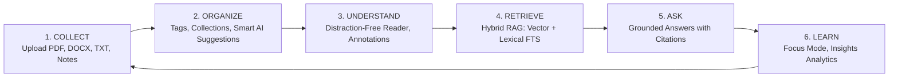
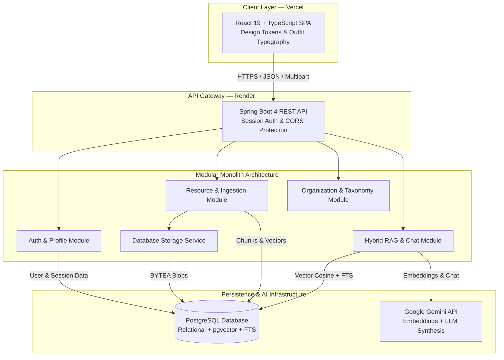
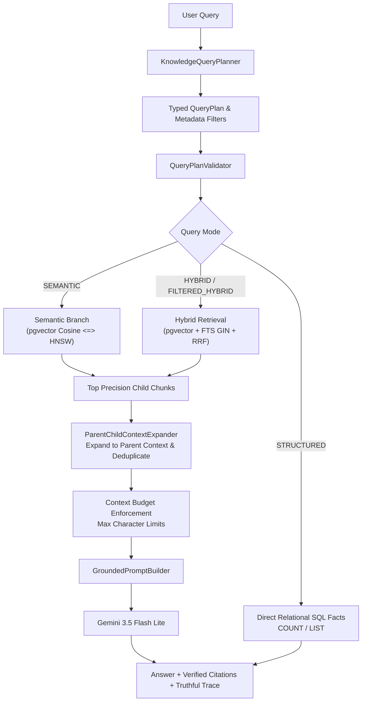
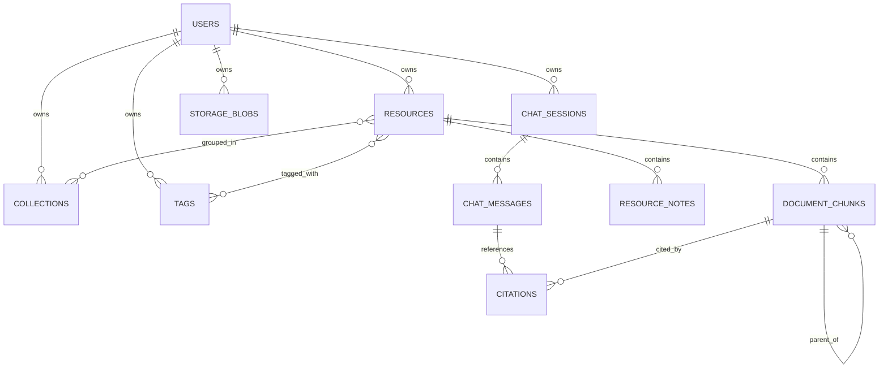

# KnowledgeOS
> An Authored Personal Knowledge Operating System with Hybrid Retrieval-Augmented Generation (RAG) and Relational Durability.

[](https://openjdk.org/projects/jdk/21/)
[](https://spring.io/projects/spring-boot)
[](https://github.com/pgvector/pgvector)
[](https://react.dev/)
[](https://ai.google.dev/)
[]()

---

## 1. What is KnowledgeOS?

**KnowledgeOS** is an authored, intelligent personal knowledge operating system designed for students, researchers, and technical professionals. It integrates classical relational note-taking with modern **Hybrid Retrieval-Augmented Generation (RAG)**, allowing users to collect heterogeneous documents, organize them with AI assistance, and interrogate their personal knowledge base through strictly grounded, verifiable multi-turn conversations.

Built as a single-process **modular monolith**, KnowledgeOS emphasizes explainable Object-Oriented design, ACID relational integrity, and high-precision information retrieval without superfluous enterprise theater.

---

## 2. The Problem It Solves

Students and researchers often accumulate fragmented PDFs, lecture slides, research papers, and quick markdown notes across disparate folders:
- **Keyword Search Fails**: Traditional search cannot understand conceptual paraphrases or synonyms.
- **Pure Vector Search Fails**: Standard semantic embeddings frequently miss exact alphanumeric tokens, CVE vulnerability codes, function names, and technical standards (e.g. `CVE-2026-8819`, `RFC-9421`).
- **Standard AI Hallucinates**: Generic chatbots fabricate facts and lack verifiable audit trails back to original source materials.

KnowledgeOS resolves these challenges with a **two-branch Hybrid Retrieval pipeline** that fuses vector cosine similarity (`pgvector`) and PostgreSQL Full-Text Search (`tsvector`/GIN) using **Reciprocal Rank Fusion (RRF)**.

---

## 3. The Core Knowledge Lifecycle



1. **Collect**: Ingest academic PDFs, Word documents, Markdown files, or create in-app notes. Binary files are durably persisted in PostgreSQL `storage_blobs`.
2. **Organize**: Group documents into collections and tags, assisted by embedding-based Smart Organization suggestions.
3. **Understand**: Read extracted text in a clean reader view and record timestamped session notes.
4. **Retrieve**: Query concepts, exact technical codes, or Vietnamese questions across 4 distinct retrieval boundaries.
5. **Ask**: Receive grounded syntheses from Google Gemini backed by clickable, verifiable citations.
6. **Learn**: Conduct timed Pomodoro focus sessions and track knowledge base growth in the Insights dashboard.

---

## 4. High-Level Architecture



---

## 5. Third-Year OOP Coursework Alignment

KnowledgeOS is designed to demonstrate clear, defensible Object-Oriented principles and design patterns:

### Strategy Pattern (`RetrievalStrategy.java`)
- **Interface**: `RetrievalStrategy` defines `retrieve(query, scope, ownerId, targetId, limit)`.
- **Implementations**:
  - `SemanticRetrievalStrategy`: Vector cosine similarity search via `pgvector`.
  - `KeywordRetrievalStrategy`: Lexical Full-Text Search via PostgreSQL `tsvector` and GIN index.
  - `HybridRetrievalStrategy` (`@Primary`): Composite strategy executing both branches and merging rankings via Reciprocal Rank Fusion ($k=60$).
- **OOP Benefit**: Adheres to the **Open/Closed Principle (OCP)**. New retrieval algorithms or rerankers can be plugged in without modifying `KnowledgeChatService`.

### Polymorphic Registry (`ResourceParser.java`)
- **Interface**: `ResourceParser` defines `supports(mimeType)` and `parse(inputStream)`.
- **Implementations**: `PdfResourceParser` (Apache PDFBox), `DocxResourceParser` (Apache POI), and `MarkdownResourceParser`.
- **OOP Benefit**: `ResourceIngestionService` iterates over registered beans and dynamically selects the appropriate extractor at runtime.

### Dependency Inversion Principle (`StorageService.java`)
- **Interface**: High-level services depend on `StorageService`.
- **Implementation**: `DatabaseStorageService` persists binary files to PostgreSQL `storage_blobs` (`BYTEA`), ensuring container restart durability without vendor lock-in.

### Rich Domain Encapsulation (`Resource.java`)
- `Resource` encapsulates its state machine transitions (`beginParsing()`, `beginChunking()`, `beginEmbedding()`, `markReady()`) preventing invalid database states.

---

## 6. RAG v2 Architecture



- **Query Planning & Validation**: `KnowledgeQueryPlanner` classifies intent into typed execution plans (`STRUCTURED`, `SEMANTIC`, `HYBRID`, `FILTERED_HYBRID`). `QueryPlanValidator` ensures strict ownership validation and scope containment without search broadening.
- **Hierarchical Ingestion**: `StructureAwareChunkingStrategy` generates large parent chunks (~1500 chars) for rich LLM context and small child chunks (~500 chars) with `EmbeddingTextBuilder` metadata for precise vector retrieval.
- **Batch Vector Embeddings**: `GeminiEmbeddingProvider` performs native multi-content batch embeddings via Google GenAI SDK (`gemini-embedding-001`, 768 dimensions).
- **Generation Model**: `gemini-3.5-flash-lite`.
- **Reciprocal Rank Fusion**:
  $$\text{RRF Score}(d) = \sum_{m \in \{\text{semantic}, \text{lexical}\}} \frac{1}{60 + \text{rank}_m(d)}$$
- **Four Retrieval Scopes**:
  1. `THIS_RESOURCE`: Filters strictly to the active document.
  2. `SELECTED_RESOURCES`: Filters to an explicit multi-document subset.
  3. `COLLECTION`: Queries all resources within a course/topic folder.
  4. `LIBRARY`: Global search across all user documents.
- **Audit Citations & Explainability**: Persistent `Citation` records link responses to verbatim chunk snippets, and a deterministic system execution trace exposes executed stages without chain-of-thought exposure.

---

## 7. Relational Database & PostgreSQL Schema

KnowledgeOS utilizes a single PostgreSQL instance for relational state, vector search, full-text search, and binary storage:



- **Migrations (Flyway V1–V15)**:
  - `V9`: Relational knowledge base foundation (`resources`, `tags`, `collections`).
  - `V10`: Vector chunks table with `vector(768)` and HNSW index.
  - `V11`: Persistent chat sessions, messages, and grounded citations.
  - `V12`: Full-Text Search tsvector column and GIN index.
  - `V13`: Durable database-backed binary storage (`storage_blobs`).
  - `V14`: Vietnamese full-text search unaccent dictionaries and immutable triggers.
  - `V15`: RAG v2 hierarchical parent-child chunks (`chunk_level`, `parent_chunk_id`, `chunking_version`).

---

## 8. Technology Stack

| Layer | Technology | Purpose |
|---|---|---|
| **Frontend Framework** | React 19 + TypeScript 5.8 | Responsive Single Page Application |
| **Bundler & Tooling** | Vite 8 + Oxlint | Fast HMR, typechecking, and asset optimization |
| **Typography & Styling** | Outfit (Self-hosted) + Vanilla CSS | Design tokens, WCAG focus rings, tactile motion |
| **Backend Framework** | Spring Boot 4.1.0 + Java 21 | Modular REST API and business services |
| **Security & Auth** | Spring Security + BCrypt | Stateful HTTP-only session cookies (`JSESSIONID`) |
| **Database** | PostgreSQL 17 + pgvector | Relational metadata, vector embeddings, and FTS |
| **Database Migrations** | Flyway | Version-controlled sequential SQL migrations |
| **AI / RAG Services** | Google Gemini API | 768-dim embeddings and grounded response generation |
| **Document Parsers** | Apache PDFBox + Apache POI | Text extraction from PDF, DOCX, and Markdown |
| **Production Hosting** | Vercel (Frontend) + Render (Backend) | Independent, scalable cloud hosting |

---

## 9. Comprehensive Documentation Suite

| Document Category | Key Document | Description | Format |
|---|---|---|---|
| **01 Guides** | 📖 [**Product Guide & User Manual**](file:///C:/Users/Bao%20Phuc/Documents/GroupSync_Build/docs/01_guides/KNOWLEDGEOS_GUIDE.md) | System overview, architecture, and complete 39-step user manual | Markdown |
| | 📄 [**Product Guide (PDF)**](file:///C:/Users/Bao%20Phuc/Documents/GroupSync_Build/docs/01_guides/KNOWLEDGEOS_GUIDE.pdf) | Formatted PDF with Times New Roman typography and Vietnamese support | PDF Export |
| **02 Technical Reference** | 🛠️ [**Detailed Technical Reference**](file:///C:/Users/Bao%20Phuc/Documents/GroupSync_Build/docs/02_technical_reference/TECHNICAL_REFERENCE.md) | Deep technical manual, physical project tree, full API catalog, and schema | Markdown |
| **03 Curriculum Mapping** | 🗺️ [**Backend Roadmap Mapping**](file:///C:/Users/Bao%20Phuc/Documents/GroupSync_Build/docs/03_curriculum_mapping/BACKEND_ROADMAP_MAPPING.md) | Educational bridge mapping KnowledgeOS to [roadmap.sh/backend](https://roadmap.sh/backend) | Markdown |
| **04 Course Defense** | 🎓 [**Course Defense Guide**](file:///C:/Users/Bao%20Phuc/Documents/GroupSync_Build/docs/04_course_defense/COURSE_DEFENSE_GUIDE.md) | 32 oral exam defense questions and concise 30–90 second spoken answers | Markdown |
| **05 QA & Demo** | 🧪 [**Manual QA Test Pack**](file:///C:/Users/Bao%20Phuc/Documents/GroupSync_Build/docs/05_qa_and_demo/TEST_CASES.md) | 28 structured manual QA test cards across 8 functional areas | Markdown |
| | 📊 [**Test Coverage Matrix**](file:///C:/Users/Bao%20Phuc/Documents/GroupSync_Build/docs/05_qa_and_demo/COVERAGE_MATRIX.md) | Comprehensive feature-to-testcase traceability matrix | Markdown |
| | ⏱️ [**Live Demo Script**](file:///C:/Users/Bao%20Phuc/Documents/GroupSync_Build/docs/05_qa_and_demo/LIVE_DEMO_SCRIPT.md) | 12-minute step-by-step practical presentation script | Markdown |
| | 📁 [**Demo Fixtures**](file:///C:/Users/Bao%20Phuc/Documents/GroupSync_Build/docs/05_qa_and_demo/fixtures) | 11 synthetic Markdown and text documents for live testing | Fixtures |
| **Master Index** | 📑 [**Docs Master Index**](file:///C:/Users/Bao%20Phuc/Documents/GroupSync_Build/docs/README.md) | Central navigation table of contents for all project documentation | Markdown |

---

## 10. Local Development Setup

### Prerequisites
- **Java**: OpenJDK 21 or higher.
- **Node.js**: Node 20+ and npm.
- **PostgreSQL**: PostgreSQL 15+ with the `pgvector` extension installed.
- **API Key**: A valid [Google Gemini API key](https://aistudio.google.com/).

### Step 1: Clone and Configure Environment
```bash
git clone https://github.com/dbp3206-source/group_sync.git knowledgeos
cd knowledgeos

# Copy backend environment template
cp .env.example .env.local
```

Configure the following variables in `.env.local`:
```ini
SPRING_DATASOURCE_URL=jdbc:postgresql://localhost:5432/knowledgeos
SPRING_DATASOURCE_USERNAME=postgres
SPRING_DATASOURCE_PASSWORD=your_postgres_password
GEMINI_API_KEY=your_gemini_api_key
```

### Step 2: Start the Backend Service
```bash
# Navigate to backend source and run Spring Boot
cd src/backend
./mvnw spring-boot:run
```
*The backend boots on `http://localhost:8080`. Flyway applies migrations V1–V13 automatically.*

### Step 3: Start the Frontend SPA
```bash
# In a separate terminal
cd src/frontend
npm install
npm run dev
```
*The frontend SPA launches at `http://localhost:5173`.*

---

## 11. Environment Variables Reference

| Variable Name | Purpose | Required Local? | Required Prod? | Secret? |
|---|---|---|---|---|
| `SPRING_DATASOURCE_URL` | JDBC database connection string | Yes | Yes | No |
| `SPRING_DATASOURCE_USERNAME` | Database connection username | Yes | Yes | No |
| `SPRING_DATASOURCE_PASSWORD` | Database connection password | Yes | Yes | **YES** |
| `GEMINI_API_KEY` | Google Gemini API key for embeddings & LLM | Yes | Yes | **YES** |
| `SERVER_PORT` | HTTP port for Spring Boot (default: 8080) | No | Yes | No |
| `SPRING_PROFILES_ACTIVE` | Active profile (`dev`, `prod`) | No | No | No |

---

## 12. Automated & Quality Testing

KnowledgeOS maintains comprehensive test coverage across backend algorithms, database durability, and RAG v2 retrieval quality:

```bash
# Run backend unit and orchestration test suite
cd src/backend
./mvnw test

# Package backend JAR
./mvnw package -DskipTests

# Run frontend typechecking and fast linting
cd ../frontend
npm run lint
npm run build
```

- **Backend Test Suite**: Automated unit and execution-path orchestration tests covering query planning, filter validation, structured execution, hybrid retrieval, parent-child expansion, and native Gemini batch embedding (plus optional live Neon pgvector and Gemini integration tests).
- **RAG Evaluation Dataset**: 34 version-controlled test cases in `refer/qa_dataset/` validated by `RagEvaluationDatasetTest.java`.
- **Manual QA Test Pack**: 28 structured test cards in `docs/05_qa_and_demo/TEST_CASES.md`.

---

## 13. System Boundaries & Future Roadmap

We maintain complete engineering transparency regarding current Phase 2 capabilities and future roadmap:

| Area | Current Phase 2 Implementation | Future Roadmap |
|---|---|---|
| **Binary File Storage** | PostgreSQL `storage_blobs` (`BYTEA`). Simple, durable, and self-contained for moderate datasets. | S3-compatible object storage (`S3StorageService`) for massive multi-terabyte binary datasets. |
| **Document Chunking** | Structure-Aware Hierarchical Chunking (Parent ~1500 chars for LLM context, Child ~500 chars for vector indexing). | Advanced Markdown AST table parser and visual layout boundary detectors. |
| **RAG Retrieval** | Intent-Aware Query Planning, pgvector cosine similarity, PostgreSQL Full-Text Search, and Reciprocal Rank Fusion ($k=60$). | Cross-Encoder neural reranker (e.g. BGE-Reranker) for optional secondary reranking. |
| **Response Streaming** | Synchronous JSON response payload with deterministic execution trace. | Server-Sent Events (SSE) for token-by-token streaming generation in the chat UI. |
| **Scanned Documents** | Text extraction via Apache PDFBox / POI. | Optical Character Recognition (OCR) pipeline using Tesseract for image-based PDFs. |

---

## 14. Project Source Tree

The repository is structured into three clean, unambiguous top-level domains:

```text
KnowledgeOS/
├── src/                                         # RUNNABLE APPLICATION SOURCE
│   ├── backend/                                 # Spring Boot 4 REST API Service (Java 21)
│   │   ├── src/main/java/com/groupsync/backend/ # Controllers, Services, Repositories, Entities
│   │   ├── src/main/resources/db/migration/     # Flyway migrations V1 through V13
│   │   ├── src/test/java/                       # 57 automated unit, repository, and service tests
│   │   ├── pom.xml                              # Maven build configuration
│   │   └── Dockerfile                           # Production container definition
│   ├── frontend/                                # React 19 + TypeScript SPA
│   │   ├── src/                                 # Pages, Components, Client API, CSS Design Tokens
│   │   ├── package.json                         # Node dependencies (React 19, Vite 8, Lucide)
│   │   └── vite.config.ts                       # Vite bundler configuration
│   └── scripts/                                 # Local development, PDF generation & test scripts
│
├── docs/                                        # READABLE PROJECT DOCUMENTATION
│   ├── README.md                                # Documentation Master Index & Catalog
│   ├── 01_guides/                               # Product Guide & Complete User Manual (MD + PDF)
│   ├── 02_technical_reference/                  # Deep Technical Reference Manual & API Catalog
│   ├── 03_curriculum_mapping/                   # Alignment against roadmap.sh/backend
│   ├── 04_course_defense/                       # 32 oral exam defense questions & concise answers
│   ├── 05_qa_and_demo/                          # 28 manual test cards, coverage matrix, live demo script
│   └── 06_historical_reports/                   # Historical integration reports & migration audit logs
│
├── refer/                                       # SUPPORTING REFERENCES & ARTIFACTS
│   ├── README.md                                # Reference catalog overview
│   ├── qa_dataset/                              # RAG benchmark dataset (rag-cases.json) & raw test files
│   ├── prompts/                                 # Historical planning and bootstrap prompt templates
│   ├── design_work/                             # UI design briefs, content outlines, and screenshots
│   └── reference_notes/                         # Reference notes (PESOC_REFERENCE_NOTES, DESIGN.md)
│
├── render.yaml                                  # Render production cloud deployment configuration
├── .gitignore                                   # Ignore rules for build, binaries, and local secrets
└── README.md                                    # Project landing page & quick start guide
```

---

## 15. Authors & Academic Credits

- **Author**: Dinh Bao Phuc (`dbp3206@gmail.com`)
- **Course**: Third-Year Computer Science / Software Engineering — Object-Oriented Programming Coursework
- **Institution**: University Software Engineering Curriculum
- **Version**: 1.0 (Production Release)
