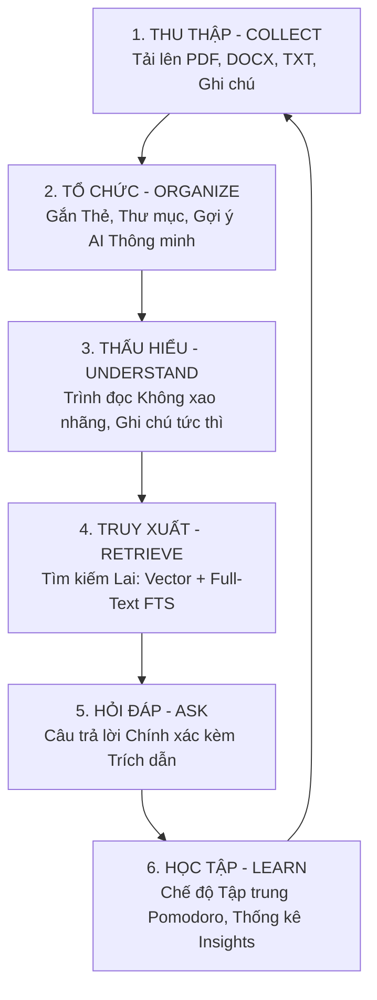
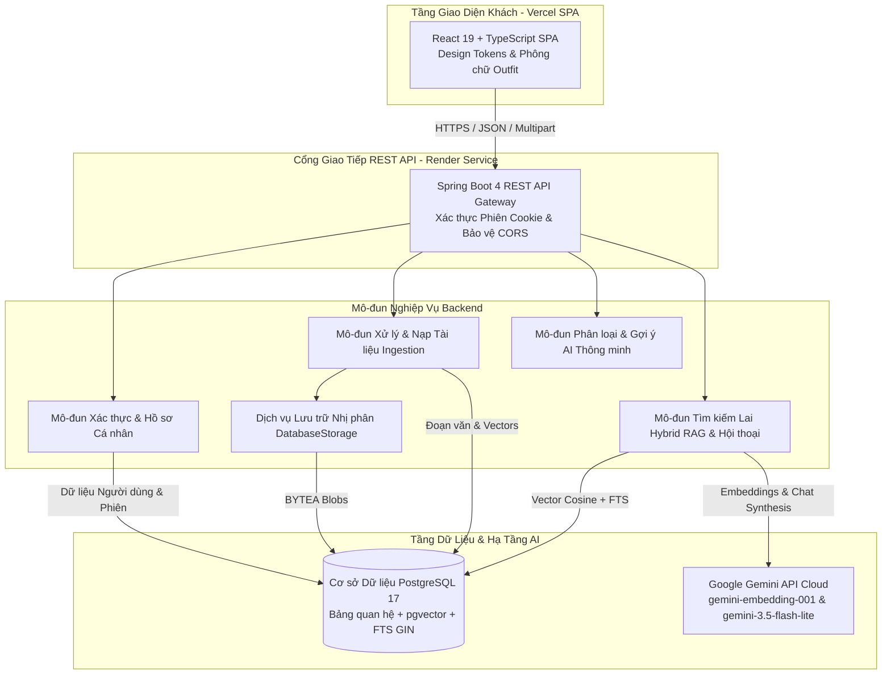

# SÁCH HƯỚNG DẪN SẢN PHẨM & SỔ TAY NGƯỜI DÙNG TOÀN DIỆN KNOWLEDGEOS
> **Tài liệu**: Hướng dẫn Sử dụng Sản phẩm & Cẩm nang Vận hành Hệ thống  
> **Mã định danh**: `docs/01_guides/KNOWLEDGEOS_GUIDE.md`  
> **Mục đích**: Cung cấp tài liệu tổng quan sản phẩm, kiến trúc hệ thống và hướng dẫn chi tiết 39 quy trình thao tác từ A-Z dành cho người dùng cuối, sinh viên, giảng viên và quản trị viên.

---

# PHẦN I: TỔNG QUAN SẢN PHẨM & KIẾN TRÚC HỆ THỐNG

---

## 1. Định nghĩa Sản phẩm & Sứ mệnh

**KnowledgeOS** là một hệ điều hành quản lý tri thức cá nhân thông minh (*Personal Knowledge Operating System*) được thiết kế chuyên biệt cho sinh viên, giảng viên, nghiên cứu sinh và các chuyên gia kỹ thuật. Hệ thống giải quyết bài toán phân mảnh tài liệu học tập bằng cách kết hợp hoàn hảo giữa **quản lý ghi chú quan hệ truyền thống** và **công nghệ tìm kiếm thông minh tăng cường tạo sinh (Hybrid RAG)**:

1. **Quản lý Tài liệu Quan hệ Xác định**: Tổ chức tài liệu khoa học theo thư mục (Collections), nhãn dán (Tags), ghi chú nghiên cứu (Notes) và lưu trữ tệp nhị phân bền vững trực tiếp trong cơ sở dữ liệu PostgreSQL.
2. **Động cơ Tìm kiếm Lai Đột phá (Hybrid RAG)**: Kết hợp đồng thời 2 nhánh truy xuất:
   - **Nhánh Ngữ nghĩa (Semantic)**: Sử dụng vector embedding 768 chiều từ Google Gemini và khoảng cách Cosine trên PostgreSQL `pgvector` với chỉ mục HNSW.
   - **Nhánh Từ khóa (Lexical)**: Sử dụng PostgreSQL Full-Text Search trên chỉ mục đảo GIN với từ điển `simple`.
   - **Hợp nhất Xếp hạng Tương hỗ (RRF - Reciprocal Rank Fusion)**: Sử dụng hằng số $k=60$ để ghép nối kết quả, đảm bảo không bỏ sót cả câu hỏi suy luận lẫn các mã định danh kỹ thuật chính xác tuyệt đối (như `CVE-2026-8819`, `RFC-9421`).
3. **Tổng hợp Tri thức Đa phạm vi & Có Trích dẫn Nguồn**: Hỏi đáp tương tác qua 4 phạm vi truy xuất độc lập (`THIS_RESOURCE`, `SELECTED_RESOURCES`, `COLLECTION`, `LIBRARY`), đi kèm trích dẫn đoạn văn gốc có thể kiểm chứng nhằm loại bỏ triệt để hiện tượng AI ảo giác (Hallucination).

---

## 2. Vòng đời Tri thức 6 Bước (The Core Knowledge Lifecycle)

1. **Thu thập (Collect)**: Tiếp nhận các tệp tài liệu đa định dạng (PDF bài giảng, đề cương Word, tài liệu Markdown) hoặc tạo nhanh ghi chú nghiên cứu trực tiếp trong ứng dụng. Hệ thống tự động phân tách văn bản (parse), chia đoạn (chunk), tạo vector nhúng (embed) và lưu trữ an toàn.
2. **Tổ chức (Organize)**: Phân loại tài liệu vào các bộ sưu tập chuyên đề và gắn nhãn theo môn học, với sự hỗ trợ của thuật toán gợi ý AI thông minh (Smart Organization Suggestions).
3. **Thấu hiểu (Understand)**: Đọc nội dung bài học trên giao diện Reader tinh gọn, tương phản cao, không xao nhãng và lưu lại các phát hiện nghiên cứu quan trọng.
4. **Truy xuất (Retrieve)**: Tìm kiếm thông tin tức thời bằng ngôn ngữ tự nhiên, từ đồng nghĩa hoặc các chuỗi ký tự mã hiệu kỹ thuật chính xác.
5. **Hỏi đáp (Ask)**: Đối thoại với trợ lý AI được kiểm soát nghiêm ngặt bởi ngữ cảnh dữ liệu riêng tư, cung cấp câu trả lời chuẩn xác cùng đường dẫn trích dẫn có thể bấm xem lại từng câu chữ gốc.
6. **Học tập (Learn)**: Rèn luyện tính kỷ luật học tập với đồng hồ Pomodoro (Focus Mode) và theo dõi tiến độ tích lũy tri thức thông qua bảng điều khiển Thống kê (Insights Dashboard).

---

## 3. Sơ đồ Kiến trúc Hệ thống Tổng thể

Hệ thống được thiết kế theo mô hình **Modular Monolith** (Đơn khối dạng mô-đun) tối ưu, phân định rõ ràng giữa các tầng trách nhiệm:

---

# PHẦN II: CẨM NANG HƯỚNG DẪN THAO TÁC 39 QUY TRÌNH CHI TIẾT

---

## Mục 1: Khởi động & Quản lý Tài khoản (Xác thực)

### Quy trình 1.1: Đăng ký Tài khoản Mới
- **Mục tiêu**: Thiết lập không gian làm việc tri thức cá nhân riêng biệt và bảo mật.
- **Đường dẫn**: `/register`
- **Các bước thực hiện**:
  1. Nhấp nút **"Đăng ký"** (Sign Up) trên thanh điều hướng đầu trang.
  2. Nhập Email học tập hợp lệ, Mật khẩu an toàn (tối thiểu 6 ký tự) và Tên hiển thị của bạn.
  3. Nhấp **"Tạo tài khoản"**. Hệ thống khởi tạo người dùng, mã hóa mật khẩu bằng BCrypt và tự động đưa bạn vào trang Tổng quan.

### Quy trình 1.2: Đăng nhập Hệ thống
- **Mục tiêu**: Truy cập vào không gian lưu trữ cá nhân đã có.
- **Đường dẫn**: `/login`
- **Các bước thực hiện**:
  1. Nhập Email và Mật khẩu đã đăng ký.
  2. Nhấp **"Đăng nhập"**. Hệ thống cấp phát Cookie phiên HTTP-only an toàn (`JSESSIONID`) và chuyển hướng về Không gian Tri thức.

### Quy trình 1.3: Cập nhật Hồ sơ Cá nhân & Đổi Mật khẩu
- **Mục tiêu**: Điều chỉnh tên hiển thị và cập nhật mật khẩu định kỳ.
- **Đường dẫn**: `/profile`
- **Các bước thực hiện**:
  1. Nhấp biểu tượng Hồ sơ cá nhân ở góc trên bên phải thanh điều hướng.
  2. Thay đổi Tên hiển thị và nhấp **"Lưu thay đổi"**.
  3. Để đổi mật khẩu, nhập Mật khẩu hiện tại, nhập Mật khẩu mới và xác nhận mật khẩu mới, sau đó nhấp **"Đổi mật khẩu"**.

### Quy trình 1.4: Đăng xuất Khỏi Hệ thống
- **Mục tiêu**: Hủy bỏ phiên làm việc trên trình duyệt dùng chung để bảo vệ dữ liệu.
- **Các bước thực hiện**:
  1. Nhấp nút **"Đăng xuất"** (Logout) ở menu góc phải.
  2. Trình duyệt gửi yêu cầu `POST /api/auth/logout`, Cookie phiên bị vô hiệu hóa ngay lập tức và trang chuyển hướng về màn hình Đăng nhập.

---

## Mục 2: Nạp Tài liệu & Quản lý Tệp (Collect)

### Quy trình 2.1: Tải lên Tài liệu Markdown (.md / .txt)
- **Mục tiêu**: Nhập tài liệu văn bản thuần hoặc ghi chú học tập.
- **Đường dẫn**: `/knowledge/library` $\to$ Modal **"Thêm tài nguyên"** (Add Resource).
- **Các bước thực hiện**:
  1. Nhấp nút **"Thêm tài nguyên"** màu xanh nổi bật tại góc trên trang Thư viện.
  2. Chọn tab **"Tải tệp lên"** (File Upload), chọn tệp `.md` hoặc `.txt` từ máy tính.
  3. Nhấp **"Tải lên"**. Hệ thống tự động phân tách văn bản, cắt đoạn 500 ký tự (overlap 100) và tạo vector nhúng 768 chiều.

### Quy trình 2.2: Tải lên Tài liệu PDF Học thuật (.pdf)
- **Mục tiêu**: Nhập bài báo khoa học, slide bài giảng hoặc sách điện tử.
- **Các bước thực hiện**:
  1. Mở modal **"Thêm tài nguyên"**, chọn tệp `.pdf`.
  2. Hệ thống sử dụng thư viện Apache PDFBox để trích xuất toàn bộ câu chữ, đồng thời lưu trữ tệp nhị phân gốc vào bảng `storage_blobs` trong cơ sở dữ liệu.
  3. Theo dõi thanh trạng thái chuyển từ `PARSING` $\to$ `CHUNKING` $\to$ `EMBEDDING` $\to$ `READY`.

### Quy trình 2.3: Tải lên Tài liệu Word (.docx)
- **Mục tiêu**: Nhập giáo trình hoặc tiểu luận định dạng Microsoft Word.
- **Các bước thực hiện**:
  1. Mở modal **"Thêm tài nguyên"**, chọn tệp `.docx`.
  2. Hệ thống sử dụng Apache POI để đọc cấu trúc văn bản, tạo chỉ mục tìm kiếm và lưu trữ an toàn.

### Quy trình 2.4: Tạo Ghi chú Nhanh Trực tiếp (Quick Note)
- **Mục tiêu**: Soạn thảo ý tưởng hoặc ghi lại bài giảng ngay trong ứng dụng mà không cần tệp ngoài.
- **Các bước thực hiện**:
  1. Trong modal **"Thêm tài nguyên"**, chọn tab **"Soạn thảo ghi chú"** (Write Note).
  2. Điền Tiêu đề ghi chú và nội dung văn bản.
  3. Nhấp **"Lưu ghi chú"**. Ghi chú được kích hoạt ngay lập tức để tìm kiếm và hỏi đáp.

### Quy trình 2.5: Theo dõi Trạng thái Xử lý Tài nguyên (Lifecycle Progress)
- **Mục tiêu**: Đảm bảo tài liệu đã hoàn tất quá trình lập chỉ mục vector.
- **Các bước thực hiện**:
  1. Trên danh sách tài liệu tại Thư viện, quan sát huy hiệu trạng thái:
     - 🟡 **PARSING**: Đang đọc văn bản.
     - 🔵 **EMBEDDING**: Đang tạo vector 768 chiều với Gemini.
     - 🟢 **READY**: Đã sẵn sàng 100% cho tìm kiếm và RAG.
     - 🔴 **FAILED**: Lỗi trích xuất (tệp hỏng hoặc ảnh scan không có lớp text).

### Quy trình 2.6: Tải về Tệp Gốc Bền vững (Download Blob)
- **Mục tiêu**: Lấy lại chính xác tệp tin gốc đã tải lên.
- **Các bước thực hiện**:
  1. Mở không gian đọc tài liệu `/knowledge/resource/:id`.
  2. Nhấp nút **"Tải tệp gốc"** (Download). Backend đọc mảng byte nhị phân từ PostgreSQL `storage_blobs` và truyền về trình duyệt với đúng định dạng MIME gốc.

### Quy trình 2.7: Xóa Tài nguyên An toàn (Cascade & Citations Safety)
- **Mục tiêu**: Dọn dẹp tài liệu cũ mà không làm hỏng dữ liệu các cuộc trò chuyện trước đó.
- **Các bước thực hiện**:
  1. Nhấp biểu tượng Thùng rác bên cạnh tài liệu và xác nhận Xóa.
  2. Hệ thống tự động gỡ liên kết khóa ngoại trong bảng `citations`, xóa sạch các vector chunk liên quan và xóa tệp blob mà không phát sinh bất kỳ lỗi ràng buộc cơ sở dữ liệu nào.

---

## Mục 3: Không gian Đọc & Ghi chú Nghiên cứu (Understand)

### Quy trình 3.1: Mở Không gian Đọc Không Xao Nhãng (Reader Workspace)
- **Đường dẫn**: `/knowledge/resource/:id`
- **Thao tác**: Nhấp vào tiêu đề tài liệu từ Thư viện. Giao diện mở ra trình đọc văn bản tinh tế với phông chữ Outfit tối ưu cho việc đọc tập trung cao độ.

### Quy trình 3.2: Ghi chép Ý tưởng Nghiên cứu (Session Notes)
- **Thao tác**: Tại khung bên phải của màn hình đọc, nhập nội dung phân tích vào ô **"Ghi chú nghiên cứu"** và nhấp **"Lưu ghi chú"**. Ghi chú được lưu trữ trực tiếp với dấu thời gian chính xác.

### Quy trình 3.3: Cập nhật Trạng thái Đọc (Reading Status)
- **Thao tác**: Chuyển đổi trạng thái tài liệu giữa `Chưa đọc` (Unread), `Đang đọc` (Reading), và `Đã hoàn thành` (Completed) để quản lý tiến độ ôn tập.

### Quy trình 3.4: Đánh dấu Tài liệu Yêu thích (Favorite Star)
- **Thao tác**: Nhấp vào biểu tượng Ngôi sao cạnh tiêu đề để ghim tài liệu vào danh sách ưu tiên.

---

## Mục 4: Tổ chức Tri thức & Gợi ý AI Thông minh (Organize)

### Quy trình 4.1: Tạo Bộ sưu tập Chuyên đề (Collections)
- **Mục tiêu**: Nhóm tài liệu theo từng môn học (ví dụ: *OOP Java*, *Cơ sở Dữ liệu*, *Trí tuệ Nhân tạo*).
- **Thao tác**: Tại thanh bên trái, nhấp nút **"+"** cạnh mục Collections, đặt tên và mô tả, sau đó nhấp **"Tạo thư mục"**.

### Quy trình 4.2: Gắn Thẻ Phân loại (Tags)
- **Thao tác**: Chọn tài liệu, nhấp **"Thêm thẻ"**, nhập tên nhãn (ví dụ: `#exam`, `#lab03`, `#architecture`) để gắn thẻ phân loại nhanh.

### Quy trình 4.3: Nhận Gợi ý Phân loại Thông minh từ AI (Smart Organization)
- **Mục tiêu**: Tự động phát hiện nhãn dán và thư mục phù hợp dựa trên nội dung tài liệu.
- **Thao tác**: Nhấp nút **"Gợi ý tổ chức"** (Smart Suggestions). Hệ thống tính toán độ tương đồng giữa nội dung bài viết với các thẻ hiện có và đề xuất chỉ với 1 cú click.

### Quy trình 4.4: Khám phá Tài liệu Liên quan (Related Resources)
- **Thao tác**: Ở chân trang đọc tài liệu, xem mục **"Tài liệu tương đồng"**. Hệ thống sử dụng khoảng cách Cosine trên `pgvector` để tự động liệt kê các bài giảng có cùng chủ đề trong kho của bạn.

---

## Mục 5: Tìm kiếm & Lọc Đa Tiêu chí (Retrieve)

### Quy trình 5.1: Tìm kiếm Tức thì theo Tiêu đề
- **Thao tác**: Nhập từ khóa vào ô tìm kiếm tại trang Thư viện để lọc danh sách tài liệu theo thời gian thực.

### Quy trình 5.2: Lọc Kết hợp theo Bộ sưu tập và Thẻ
- **Thao tác**: Nhấp chọn đồng thời một Thư mục và một Thẻ tại thanh bên trái để thu hẹp chính xác nhóm tài liệu cần xem.

### Quy trình 5.3: Lọc theo Định dạng Tệp
- **Thao tác**: Bấm chọn các nút lọc nhanh định dạng: `PDF`, `DOCX`, `Markdown`, hoặc `Ghi chú`.

---

## Mục 6: Hỏi Đáp Thông Minh & Trích Dẫn Nguồn (Hybrid RAG & Ask)

### Quy trình 6.1: Khởi tạo Cuộc trò chuyện Mới
- **Đường dẫn**: `/knowledge/ask`
- **Thao tác**: Nhấp **"Cuộc trò chuyện mới"** (New Chat). Hệ thống tạo một phiên trò chuyện mới trong cơ sở dữ liệu (`chat_sessions`).

### Quy trình 6.2: Chọn Phạm vi Truy xuất `THIS_RESOURCE`
- **Mục tiêu**: Chỉ hỏi đáp duy nhất trên 1 tài liệu đang mở.
- **Thao tác**: Chọn phạm vi **"Tài liệu này"** trên thanh chọn phạm vi.

### Quy trình 6.3: Chọn Phạm vi Truy xuất `SELECTED_RESOURCES`
- **Mục tiêu**: Đối chiếu, so sánh giữa 2 hoặc nhiều tài liệu cụ thể do bạn chọn.
- **Thao tác**: Chọn **"Tài liệu tùy chọn"** và tích chọn các tài liệu cần phân tích.

### Quy trình 6.4: Chọn Phạm vi Truy xuất `COLLECTION`
- **Mục tiêu**: Hỏi đáp trên toàn bộ tài liệu thuộc 1 môn học.
- **Thao tác**: Chọn phạm vi **"Bộ sưu tập"** và chọn môn học tương ứng.

### Quy trình 6.5: Chọn Phạm vi Truy xuất `LIBRARY`
- **Mục tiêu**: Truy xuất tri thức toàn diện trên tất cả tài liệu bạn đang sở hữu.
- **Thao tác**: Chọn phạm vi **"Toàn bộ thư viện"**.

### Quy trình 6.6: Hỏi đáp bằng Ngôn ngữ Tự nhiên & Tiếng Việt Kỹ thuật
- **Thao tác**: Nhập câu hỏi (ví dụ: *"Giải thích mẫu thiết kế Strategy và ưu điểm của nó trong dự án?"*). Hệ thống tìm kiếm lai, gửi ngữ cảnh chuẩn xác cho Gemini và trả lời bằng tiếng Việt mạch lạc.

### Quy trình 6.7: Hỏi đáp với Từ khóa & Mã định danh Chính xác (FTS Precision)
- **Thao tác**: Nhập câu hỏi chứa mã kỹ thuật (ví dụ: *"Thông tin lỗ hổng CVE-2026-8819 là gì?"*). Nhánh Lexical FTS sẽ tìm thấy chính xác đoạn văn chứa mã này và đưa vào câu trả lời mà không bị trôi như vector thông thường.

### Quy trình 6.8: Bấm Xem Trích dẫn Nguồn Gốc (Verifiable Citations)
- **Thao tác**: Dưới mỗi câu trả lời của AI có các nhãn trích dẫn `[1]`, `[2]`. Nhấp vào nhãn trích dẫn để mở khung xem trước trích đoạn văn bản gốc và vị trí trang/đoạn tương ứng.

### Quy trình 6.9: Quản lý Lịch sử Hội thoại Nhiều Lượt (Persistent Chat)
- **Thao tác**: Toàn bộ câu hỏi, câu trả lời và trích dẫn được lưu vĩnh viễn trong PostgreSQL. Bạn có thể mở lại bất kỳ cuộc trò chuyện cũ nào từ danh sách lịch sử ở thanh bên trái.

---

## Mục 7: Chế độ Tập trung Pomodoro & Thống kê Tri thức (Learn)

### Quy trình 7.1: Bắt đầu Phiên Tập trung Pomodoro (Focus Mode)
- **Đường dẫn**: `/knowledge/focus`
- **Thao tác**: Chọn tài liệu cần học, đặt thời gian (mặc định 25 phút) và nhấp **"Bắt đầu tập trung"**. Màn hình chuyển sang chế độ tĩnh lặng, đồng hồ đếm ngược kích hoạt giúp bạn tập trung tuyệt đối.

### Quy trình 7.2: Tạm dừng và Hoàn thành Phiên Học
- **Thao tác**: Nhấp **"Tạm dừng"** khi có việc gấp hoặc để đồng hồ chạy hết 25 phút. Hệ thống ghi nhận thêm 1 phiên học thành công vào lịch sử cá nhân.

### Quy trình 7.3: Xem Bảng Thống kê Tri thức (Insights Dashboard)
- **Đường dẫn**: `/knowledge/insights`
- **Thao tác**: Xem biểu đồ phân bố tài liệu theo môn học, tổng dung lượng lưu trữ, tổng số vector chunk đã lập chỉ mục và số giờ đã học tập trung.

---

## Mục 8: Tương thích Đa Thiết bị & Trợ năng (Mobile & Accessibility)

### Quy trình 8.1: Sử dụng trên Điện thoại Di động (Mobile View)
- **Thao tác**: Truy cập trang web trên điện thoại (độ rộng 375px–430px). Menu tự động chuyển sang dạng thu gọn, vùng bấm đạt chuẩn tối thiểu 44px, hỗ trợ thao tác chạm mượt mà.

### Quy trình 8.2: Hỗ trợ Giảm Chuyển động (Prefers Reduced Motion)
- **Thao tác**: Nếu thiết bị bật chế độ giảm hiệu ứng chuyển động trong hệ điều hành, toàn bộ hiệu ứng lướt và hoạt ảnh sẽ tự động tắt để bảo vệ thị giác và hạn chế chóng mặt.
