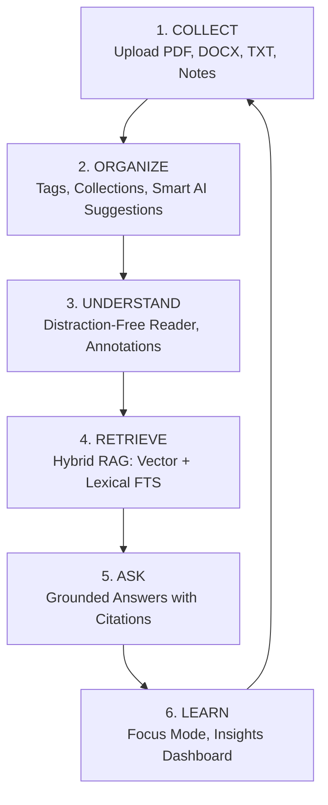
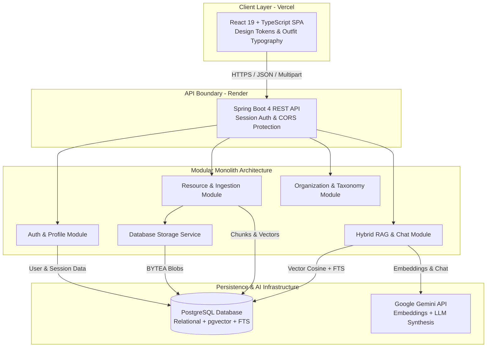

# KnowledgeOS — Complete Product Guide & User Manual
> Comprehensive System Overview, High-Level Architecture, and Step-by-Step User Workflows

---

# PART I: PRODUCT OVERVIEW & HIGH-LEVEL ARCHITECTURE

---

## 1. Product Definition & Purpose

**KnowledgeOS** is an authored, intelligent personal knowledge operating system engineered for students, researchers, and technical professionals. It bridges the gap between structured relational note-taking and high-precision AI retrieval by combining:

1. **Deterministic Document Management**: Full relational organization with collections, tags, session notes, and durable database-backed file storage.
2. **Hybrid Retrieval-Augmented Generation (RAG)**: A dual-branch retrieval pipeline that pairs dense vector cosine similarity (`pgvector`) with exact lexical Full-Text Search (PostgreSQL FTS) using Reciprocal Rank Fusion ($k=60$).
3. **Multi-Scope Grounded Synthesis**: Conversational exploration across four distinct retrieval boundaries (`THIS_RESOURCE`, `SELECTED_RESOURCES`, `COLLECTION`, and `LIBRARY`) backed by verifiable source citations.

---

## 2. The Core Knowledge Lifecycle

1. **Collect**: Ingest academic PDFs, specifications, lecture notes, or in-app Markdown memos. Files are automatically parsed, chunked, embedded, and stored securely in PostgreSQL.
2. **Organize**: Categorize resources using hierarchical collections and tags, augmented by heuristic and embedding-based Smart Organization suggestions.
3. **Understand**: Read extracted text in a clean, high-contrast Reader interface and record inline research notes.
4. **Retrieve**: Query documents using conceptual language, exact alphanumeric identifiers (e.g. `CVE-2026-8819`, `RFC-9421`), or Vietnamese questions.
5. **Ask**: Receive syntheses from Google Gemini that are strictly grounded in your private notes, complete with verifiable citation links.
6. **Learn**: Reinforce concentration using timed Focus study sessions and review knowledge growth via the Insights dashboard.

---

## 3. High-Level System Architecture

KnowledgeOS is built as a single-process **modular monolith** with clean architectural boundaries:

### Key Architectural Characteristics
- **Frontend**: React 19, TypeScript, Vite, React Router, Design Tokens (`--gs-*` and `--kos-*`), self-hosted `Outfit` typography, and WCAG accessibility.
- **Backend**: Java 21, Spring Boot 4, Spring Security (stateful HTTP-only session cookies), Spring Data JPA, and Bean Validation.
- **Database**: PostgreSQL with `pgvector` (768-dimensional embeddings), PostgreSQL Full-Text Search (`tsvector`/GIN), and Flyway schema migrations (V1–V13).
- **AI Infrastructure**: Google Gemini (`gemini-embedding-001` for 768-dim embeddings, `gemini-3.5-flash-lite` for grounded response synthesis).

---

# PART II: COMPLETE STEP-BY-STEP USER MANUAL

---

## Section 1: Getting Started & Authentication

### 1.1 Creating an Account
- **Goal**: Provision a new private knowledge workspace.
- **Where to Go**: `/register`
- **Steps**:
  1. Click **"Sign Up"** from the landing page.
  2. Enter your Full Name, Email Address, and Password (min. 8 characters).
  3. Click **"Create Account"**.
- **Expected Result**: Account is created in PostgreSQL with BCrypt password hashing, and you are redirected to the login page.

### 1.2 Signing In
- **Goal**: Authenticate and establish a secure session.
- **Where to Go**: `/login`
- **Steps**:
  1. Enter your registered email and password.
  2. Click **"Sign In"**.
- **Expected Result**: Server sets a secure `JSESSIONID` cookie and redirects you to the KnowledgeOS Home Dashboard (`/app`).

### 1.3 Signing Out
- **Goal**: Terminate your active session cleanly.
- **Where to Go**: Sidebar Footer → **"Sign Out"** button.
- **Steps**:
  1. Click **"Sign Out"**.
- **Expected Result**: Server session is invalidated and browser redirects to the login screen. Attempting to access `/app/library` directly will redirect back to `/login`.

---

## Section 2: Ingesting & Managing Documents

### 2.1 Importing a PDF Document
- **Goal**: Ingest an academic paper or technical manual.
- **Where to Go**: `/app/library` → Click **"Import"** button.
- **Steps**:
  1. In the upload modal, drag and drop a `.pdf` file (or click to browse).
  2. (Optional) Provide a custom Title and Description.
  3. Click **"Upload & Ingest"**.
- **Expected Result**: The file uploads via multipart HTTP. Status transitions from `UPLOADED` -> `PARSING` (Apache PDFBox) -> `CHUNKING` -> `EMBEDDING` (Gemini) -> `READY`.
- **Notes**: Binary file bytes are stored durably in PostgreSQL `storage_blobs`.

### 2.2 Importing a Microsoft Word (`.docx`) File
- **Goal**: Ingest a Word document.
- **Where to Go**: `/app/library` → **"Import"**.
- **Steps**:
  1. Select a `.docx` file and submit.
- **Expected Result**: Document text is extracted via Apache POI and indexed for search.

### 2.3 Importing Markdown (`.md`) or Plain Text (`.txt`) Files
- **Goal**: Ingest structured text files.
- **Where to Go**: `/app/library` → **"Import"**.
- **Steps**:
  1. Select a `.md` or `.txt` file and submit.
- **Expected Result**: Plain text parser processes headers, lists, and code blocks into indexed chunks.

### 2.4 Creating an In-App Note Resource
- **Goal**: Write a new memo or meeting summary directly in KnowledgeOS.
- **Where to Go**: `/app/library` → Click **"New Note"**.
- **Steps**:
  1. Enter a Title (e.g. *"Meeting Notes on Architecture"*).
  2. Write your Markdown or plain text notes in the content textarea.
  3. Click **"Save Note"**.
- **Expected Result**: Note appears immediately in the Library grid with `READY` status and is available for RAG retrieval.

### 2.5 Understanding Document Processing States
| State Badge | Meaning | Next Transition |
|---|---|---|
| `UPLOADED` | File received and binary bytes saved in storage. | Automatically enters `PARSING`. |
| `PARSING` | Text extractor (PDFBox/POI) is reading document structure. | Enters `CHUNKING`. |
| `CHUNKING` | Text is being partitioned into 500-character segments. | Enters `EMBEDDING`. |
| `EMBEDDING` | Google Gemini is generating 768-dim vector embeddings. | Enters `READY`. |
| `READY` | Document is fully indexed for semantic, lexical, and hybrid search. | Usable in Reader and Ask. |
| `FAILED` | Ingestion encountered an unrecoverable parse or network error. | Click **"Retry"** to re-process. |

---

## Section 3: Workspace, Reader & Inline Notes

### 3.1 Opening the Resource Workspace
- **Goal**: Inspect a document's details, text, and annotations.
- **Where to Go**: Click any resource card in `/app/library`.
- **Steps**:
  1. Navigate to `/app/resource/{id}`.
- **Expected Result**: Workspace opens showing five contextual tabs: **Overview**, **Reader**, **Notes**, **Related**, and **Activity**.

### 3.2 Reading Full Document Text (Reader Tab)
- **Goal**: Read extracted document text without downloading original files.
- **Where to Go**: Workspace → **Reader** tab.
- **Steps**:
  1. Click **"Reader"**.
- **Expected Result**: Extracted text renders with clean typography, proper line breaks, and responsive padding.

### 3.3 Adding & Deleting Research Notes (Notes Tab)
- **Goal**: Attach timestamped notes to a specific resource.
- **Where to Go**: Workspace → **Notes** tab.
- **Steps**:
  1. Type a note into the textarea.
  2. Click **"Add Note"**.
  3. To delete, click the trash icon next to any note.
- **Expected Result**: Notes persist in the database and display chronologically.

### 3.4 Viewing Semantically Related Documents (Related Tab)
- **Goal**: Discover other documents in your library with similar concepts.
- **Where to Go**: Workspace → **Related** tab.
- **Steps**:
  1. Click **"Related"**.
- **Expected Result**: Lists library resources ranked by vector cosine similarity. Clicking any recommendation opens that resource.

### 3.5 Updating Reading Progress & Favorite Status (Activity Tab)
- **Goal**: Track your reading completion and bookmark important materials.
- **Where to Go**: Workspace → **Overview** or **Activity** tab.
- **Steps**:
  1. Click the Star icon to toggle Favorite.
  2. Adjust the Reading Progress slider (0% to 100%).
- **Expected Result**: Changes save immediately via `PATCH /api/resources/{id}`.

---

## Section 4: Organization, Tags & Collections

### 4.1 Creating and Assigning Tags
- **Goal**: Label resources with descriptive keywords.
- **Where to Go**: Resource Workspace → Overview tab.
- **Steps**:
  1. Type a tag name (e.g. `security`, `algorithms`) into the tag input and press Enter.
- **Expected Result**: Tag appears as a pill badge. Tags are automatically normalized to lowercase.

### 4.2 Grouping Documents into Collections
- **Goal**: Create folders for specific courses or research projects.
- **Where to Go**: Resource Workspace → Collection dropdown.
- **Steps**:
  1. Select an existing collection or type a new collection name (e.g. *"Computer Science 301"*).
- **Expected Result**: Resource is assigned to the collection join table.

### 4.3 Using Smart Organization AI Suggestions
- **Goal**: Automatically organize untagged library items.
- **Where to Go**: `/app/library` → Click **"Smart Organize"** button.
- **Steps**:
  1. Review the list of AI-generated tag and collection suggestions.
  2. Uncheck any suggestions you wish to discard.
  3. Click **"Apply Suggestions"**.
- **Expected Result**: Suggestions are committed in a single batch database transaction.

---

## Section 5: Library Search & Multi-Filter Queries

### 5.1 Real-Time Text Search
- **Goal**: Quickly find documents by title or description.
- **Where to Go**: `/app/library` → Search input.
- **Steps**:
  1. Type a search query (e.g. *"Architecture"*).
- **Expected Result**: Library grid updates dynamically as you type, filtering matching cards.

### 5.2 Filtering by Tag and Collection
- **Goal**: Narrow library view to specific topics.
- **Where to Go**: `/app/library` → Filter toolbar.
- **Steps**:
  1. Select Tag dropdown → choose `oop`.
  2. Select Collection dropdown → choose *"Computer Science 301"*.
- **Expected Result**: Only resources satisfying BOTH criteria are displayed.

---

## Section 6: Conversational RAG & Retrieval Scopes

### 6.1 Asking a Question with Hybrid RAG
- **Goal**: Query your knowledge base and receive grounded answers.
- **Where to Go**: `/app/ask`
- **Steps**:
  1. Select your desired **Retrieval Scope** (default is `LIBRARY`).
  2. Type your question (e.g. *"What are the SOLID principles of OOP?"*).
  3. Click **"Ask KnowledgeOS"** (or press Ctrl+Enter).
- **Expected Result**: The system runs semantic vector search and lexical FTS, merges them via RRF, sends grounded evidence to Gemini, and renders the answer with citations.

### 6.2 Selecting the 4 Retrieval Scopes
KnowledgeOS provides 4 precise retrieval boundaries:

1. **`THIS_RESOURCE`**:
   - *Use Case*: You are studying a single paper and want answers strictly from that paper.
   - *Behavior*: Backend enforces `resource_id = :targetId`.
2. **`SELECTED_RESOURCES`**:
   - *Use Case*: You want to compare 2 or 3 specific documents.
   - *Behavior*: Check the desired documents in the resource picker; backend enforces `resource_id IN (:ids)`.
3. **`COLLECTION`**:
   - *Use Case*: You want to query all materials in a specific course folder.
   - *Behavior*: Select the collection name; backend filters by collection join.
4. **`LIBRARY`**:
   - *Use Case*: Global search across your entire personal knowledge base.
   - *Behavior*: Searches all `READY` documents owned by your account.

### 6.3 Inspecting Verifiable Source Citations
- **Goal**: Audit the factual evidence behind an AI-generated answer.
- **Where to Go**: `/app/ask` → Below the assistant response.
- **Steps**:
  1. Click any citation badge (e.g. `[1]`, `[2]`).
- **Expected Result**: A citation drawer opens showing the exact source document title, chunk index, similarity score, and verbatim extracted text. Click **"Open in Reader"** to jump directly to the document.

### 6.4 Continuing Multi-Turn Conversations
- **Goal**: Ask follow-up questions maintaining chat context.
- **Where to Go**: `/app/ask`
- **Steps**:
  1. Type a follow-up (e.g. *"Can you give a Java code example of the first principle?"*).
  2. Submit.
- **Expected Result**: Multi-turn history is preserved in PostgreSQL `chat_messages` and displayed in the left conversation history rail.

### 6.5 Handling Unsupported Questions (Anti-Hallucination)
- **Goal**: Verify behavior when documents do not contain the answer.
- **Steps**:
  1. Query an off-topic question (e.g. *"What is the recipe for chocolate cake?"*).
- **Expected Result**: The system explicitly responds: *"I cannot find information about chocolate cake recipes in your library documents"*, avoiding fabricated hallucinations.

---

## Section 7: Focus Mode, Insights & Account Management

### 7.1 Using Focus Mode for Timed Study Blocks
- **Goal**: Eliminate interface distractions during deep reading.
- **Where to Go**: `/app/focus`
- **Steps**:
  1. Select a document from your library.
  2. Choose a timer interval (e.g. 25 minutes Pomodoro).
  3. Click **"Start Focus"**.
- **Expected Result**: Navigation collapses into a distraction-free stage with an active countdown timer.

### 7.2 Viewing Analytics in Insights Dashboard
- **Goal**: Track knowledge base growth and document composition.
- **Where to Go**: `/app/insights`
- **Expected Result**: Displays Total Resources, Total Chunks, Estimated Reading Time, and Tag breakdown.

### 7.3 Updating Profile and Changing Password
- **Goal**: Maintain user account credentials.
- **Where to Go**: `/app/profile`
- **Steps**:
  1. Update Display Name, enter current password and new password.
  2. Click **"Update Profile"**.
- **Expected Result**: Profile is updated and new credentials are confirmed.

### 7.4 Safely Deleting a Resource
- **Goal**: Permanently remove a document and clean up all dependent records.
- **Where to Go**: Resource Workspace → Click **"Delete"**.
- **Steps**:
  1. Click **"Delete"**.
  2. Click the red confirmation button.
- **Expected Result**: Resource, chunks, binary storage blobs, and associated citations are safely removed without database errors.
