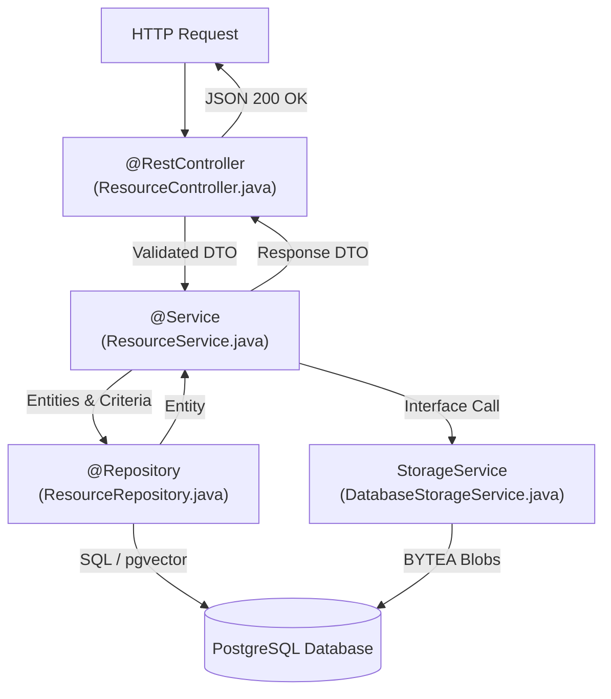
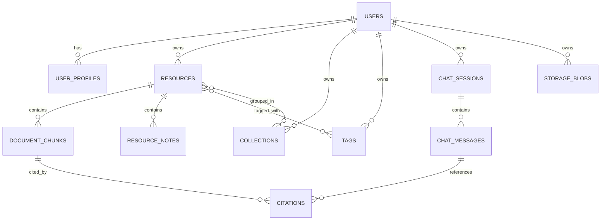
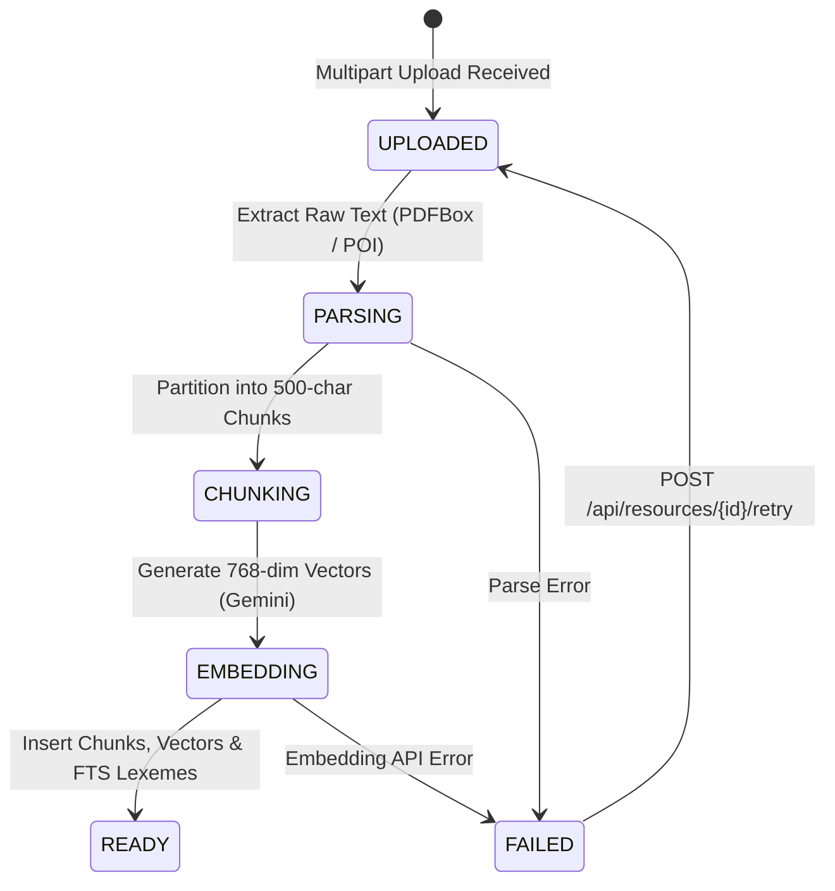
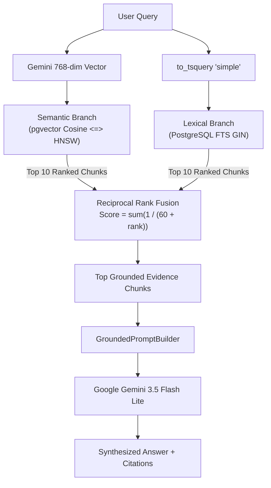
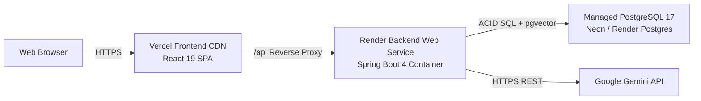

# KnowledgeOS — Detailed Technical Reference Manual
> Deep Technical Specification, Source Code Architecture, Complete API Catalog, Database Schema, and RAG Engineering Reference

---

## Table of Contents
1. [Physical Project Tree & Modular Architecture](#1-physical-project-tree--modular-architecture)
2. [Frontend Architecture & Component Design](#2-frontend-architecture--component-design)
3. [Backend Architecture & Spring Boot Engineering](#3-backend-architecture--spring-boot-engineering)
4. [Object-Oriented Programming (OOP) Deep Dive](#4-object-oriented-programming-oop-deep-dive)
5. [Complete REST API Catalog](#5-complete-rest-api-catalog)
6. [Relational Database & PostgreSQL Schema Catalog](#6-relational-database--postgresql-schema-catalog)
7. [Database Migrations: Flyway Evolution (V1–V13)](#7-database-migrations-flyway-evolution-v1v13)
8. [AI & Hybrid RAG Engineering Deep Dive](#8-ai--hybrid-rag-engineering-deep-dive)
9. [Smart Organization & Taxonomy](#9-smart-organization--taxonomy)
10. [Security, Session Management & Owner Isolation](#10-security-session-management--owner-isolation)
11. [Testing & Quality Assurance Architecture](#11-testing--quality-assurance-architecture)
12. [Cloud Deployment & Production Architecture](#12-cloud-deployment--production-architecture)
13. [End-to-End Traces: From User Action to Database](#13-end-to-end-traces-from-user-action-to-database)
14. [Technical Glossary](#14-technical-glossary)
15. [Eight-Level Learning Curriculum](#15-eight-level-learning-curriculum)
16. [Unused Backend Roadmap Topics](#16-unused-backend-roadmap-topics)

---

## 1. Physical Project Tree & Modular Architecture

KnowledgeOS is organized as a single Git repository containing a modern React TypeScript single-page application and a robust Spring Boot 4 backend.

```text
KnowledgeOS/
├── backend/
│   ├── pom.xml                                  # Maven dependencies (Spring Boot 4, pgvector, PDFBox, POI)
│   ├── mvnw / mvnw.cmd                          # Apache Maven Wrapper
│   └── src/
│       ├── main/
│       │   ├── java/com/groupsync/backend/
│       │   │   ├── GroupSyncBackendApplication.java
│       │   │   ├── auth/                        # Security, sessions, BCrypt, AuthController
│       │   │   ├── knowledge/
│       │   │   │   ├── controller/              # Resource, Chat, Workspace, Dashboard controllers
│       │   │   │   ├── dto/                     # Request and Response Data Transfer Objects
│       │   │   │   ├── model/                   # JPA Entities: Resource, DocumentChunk, Citation, ChatSession
│       │   │   │   ├── rag/                     # Retrieval strategies (Hybrid, Semantic, Lexical, RRF, Prompt)
│       │   │   │   ├── repository/              # Spring Data JPA repositories & query interfaces
│       │   │   │   ├── service/                 # ResourceService, KnowledgeChatService, IngestionService
│       │   │   │   └── storage/                 # StorageService, DatabaseStorageService (BYTEA blobs)
│       │   │   ├── shared/                      # Global exception handlers, response wrappers
│       │   │   └── user/                        # Profile and user avatar services
│       │   └── resources/
│       │       ├── application.properties       # Spring configuration & datasource templates
│       │       └── db/migration/                # 13 Flyway SQL migrations (V1 through V13)
│       └── test/java/com/groupsync/backend/     # 57 automated unit, repository, and service tests
│
├── frontend/
│   ├── package.json                             # React 19, TypeScript, Vite, Lucide, Fontsource Outfit
│   ├── vite.config.ts                           # Vite bundler configuration
│   └── src/
│       ├── api/                                 # Axios REST client modules (auth, knowledge, profile)
│       ├── auth/                                # AuthContext, session listener, protected routes
│       ├── components/                          # UI components: Avatar, ProtectedRoute, WorkspaceTabs
│       ├── pages/                               # KnowledgeHomePage, KnowledgeLibraryPage, KnowledgeAskPage, etc.
│       ├── styles/                              # tokens.css, redesign.css, app-shell.css
│       ├── App.tsx                              # React Router route registry
│       ├── index.css                            # Global reset & baseline font configuration
│       └── main.tsx                             # Application entry point with Outfit font imports
│
├── docs/
│   ├── KNOWLEDGEOS_GUIDE.md                     # Product overview & complete 39-step user manual
│   ├── KNOWLEDGEOS_GUIDE.pdf                    # Visual PDF export with Times New Roman typography
│   ├── TECHNICAL_REFERENCE.md                   # This comprehensive technical manual
│   ├── BACKEND_ROADMAP_MAPPING.md               # Alignment against roadmap.sh/backend
│   ├── COURSE_DEFENSE_GUIDE.md                  # 32 oral exam defense questions & concise answers
│   └── demo-testcases/
│       ├── TEST_CASES.md                        # 28 structured manual QA test cards
│       ├── COVERAGE_MATRIX.md                   # Feature to testcase mapping
│       ├── LIVE_DEMO_SCRIPT.md                  # 12-minute oral exam live demo script
│       └── fixtures/                            # 11 synthetic markdown test fixtures
│
├── render.yaml                                  # Render production backend configuration
├── .gitignore                                   # Ignore rules for build, binaries, and local secrets
└── README.md                                    # Project landing page & quick start guide
```

---

## 2. Frontend Architecture & Component Design

### 2.1 React 19 & TypeScript Foundations
The frontend is constructed with **React 19** and **TypeScript 5.8** using **Vite** for sub-second hot-module reloading and optimized static asset chunking.

- **Component Hierarchy**:
  - `App.tsx`: Central router wrapped with `AuthProvider` and `BrowserRouter`.
  - `ProtectedRoute.tsx`: Route guard checking `AuthContext.user`. Unauthenticated access redirects immediately to `/login`.
  - `KnowledgeLibraryPage.tsx`: Manages library state (search query `q`, active `tagId`, active `collectionId`, import modal state, resources array).
  - `ResourceWorkspacePage.tsx`: Tabbed workstation (`Overview`, `Reader`, `Notes`, `Related`, `Activity`) parameterized by `/app/resource/:id`.
  - `KnowledgeAskPage.tsx`: Dual-pane conversational RAG stage (left: chat sessions history; right: grounded question stage with scope picker and citation drawer).

### 2.2 Design System & Control Language
All styling is written in **Vanilla CSS** using CSS custom property design tokens without utility framework bloat:
- **Display Typography**: `@fontsource/outfit` (400, 500, 600, 700 weights) bundled as static `.woff2` assets.
- **Control Language Tokens**:
  - Border radius: `6px` on inputs/selects, `7px` on buttons (`.kos-button`).
  - High-visibility focus ring: `outline: none; border-color: var(--kos-blue); box-shadow: 0 0 0 3px color-mix(in srgb, var(--kos-blue) 18%, transparent);` on `:focus-visible`.
  - Tactile interaction: `transform: translateY(1px) scale(0.99);` on `.kos-button:active`.
  - Motion system (MOTION_INTENSITY=3): Page entry slide (`kos-page-enter`), modal backdrop fade (`kos-modal-in`), and tab color transitions (150ms ease).
  - Accessibility: Gated by `@media (prefers-reduced-motion: no-preference)` with 0.01ms fallback under `prefers-reduced-motion: reduce`.

---

## 3. Backend Architecture & Spring Boot Engineering

### 3.1 Controller -> Service -> Repository Pattern
KnowledgeOS strictly follows the classic Spring layered architecture:



### 3.2 Key Backend Packages
- `com.groupsync.backend.knowledge.controller`: Exposes REST endpoints (`ResourceController`, `KnowledgeChatController`, `KnowledgeWorkspaceController`, `KnowledgeDashboardController`).
- `com.groupsync.backend.knowledge.service`: Coordinates transactions, ingestion pipelines, and retrieval synthesis (`ResourceService`, `ResourceIngestionService`, `KnowledgeChatService`, `KnowledgeWorkspaceService`, `OrganizationSuggestionService`).
- `com.groupsync.backend.knowledge.model`: JPA Entities with encapsulated lifecycle behaviors (`Resource`, `DocumentChunk`, `Citation`, `ChatSession`, `ChatMessage`).
- `com.groupsync.backend.knowledge.repository`: Spring Data interfaces (`ResourceRepository`, `DocumentChunkRepository`, `CitationRepository`, `ChatSessionRepository`).
- `com.groupsync.backend.knowledge.rag`: RAG strategies, Gemini embedding/language clients, prompt builders (`HybridRetrievalStrategy`, `SemanticRetrievalStrategy`, `KeywordRetrievalStrategy`, `GroundedPromptBuilder`).
- `com.groupsync.backend.knowledge.storage`: File persistence abstraction (`StorageService`, `DatabaseStorageService`).

---

## 4. Object-Oriented Programming (OOP) Deep Dive

KnowledgeOS provides clear, explainable demonstrations of the core pillars of OOP and classical design patterns.

### 4.1 The Strategy Pattern: Multi-Branch Retrieval
- **Problem**: We need to support semantic search, lexical search, and hybrid fusion without hardcoding specific query logic into the chat service.
- **Abstraction**: Interface `RetrievalStrategy.java`:
  ```java
  public interface RetrievalStrategy {
      List<RetrievedChunk> retrieve(String query, RetrievalScope scope, Long ownerId, Long targetId, int limit);
  }
  ```
- **Implementations**:
  1. `SemanticRetrievalStrategy`: Vector cosine similarity search against `pgvector`.
  2. `KeywordRetrievalStrategy`: Lexical full-text search against PostgreSQL `tsvector` using GIN index.
  3. `HybridRetrievalStrategy` (annotated `@Primary`): Invokes semantic and lexical branches concurrently and merges rankings using Reciprocal Rank Fusion ($k=60$).
- **Benefit**: Adheres to the **Open/Closed Principle (OCP)**. New rerankers (e.g. cross-encoders) can be added as new implementations of `RetrievalStrategy` without modifying `KnowledgeChatService`.

### 4.2 Polymorphic Document Parsers & Registry
- **Problem**: The system must ingest diverse file formats (`.pdf`, `.docx`, `.md`, `.txt`) with different extraction libraries.
- **Abstraction**: Interface `ResourceParser.java`:
  ```java
  public interface ResourceParser {
      boolean supports(String mimeType);
      String parse(InputStream input) throws IOException;
  }
  ```
- **Polymorphic Implementations**:
  - `PdfResourceParser`: Uses Apache PDFBox (`PDDocument.load()`).
  - `DocxResourceParser`: Uses Apache POI (`XWPFDocument`).
  - `MarkdownResourceParser` / `TextResourceParser`: Direct UTF-8 string extraction.
- **Registry Execution**: `ResourceIngestionService` injects `List<ResourceParser> parsers` and dynamically selects the matching parser at runtime:
  ```java
  ResourceParser parser = parsers.stream()
      .filter(p -> p.supports(mimeType))
      .findFirst()
      .orElseThrow(() -> new UnsupportedMediaTypeException("Unsupported format: " + mimeType));
  ```

### 4.3 Dependency Inversion Principle (DIP): Storage Subsystem
- **Problem**: High-level resource ingestion should not be tightly coupled to local disk or a specific cloud vendor.
- **Abstraction**: Interface `StorageService.java`:
  ```java
  public interface StorageService {
      String store(Long ownerId, String filename, byte[] content, String mimeType);
      byte[] load(Long ownerId, String storageKey);
      void delete(Long ownerId, String storageKey);
  }
  ```
- **Implementation**: `DatabaseStorageService.java` writes binary bytes to the PostgreSQL `storage_blobs` table (`BYTEA`).
- **Benefit**: Swapping from database storage to AWS S3 in v2 requires only implementing `S3StorageService` without touching `ResourceService`.

### 4.4 Encapsulation & Rich Domain Entities
- **Problem**: Entity state transitions must remain valid and consistent across concurrent operations.
- **Implementation**: `Resource.java` encapsulates internal state with domain transition methods:
  ```java
  public void beginParsing() {
      if (this.status != ResourceStatus.UPLOADED && this.status != ResourceStatus.FAILED) {
          throw new IllegalStateException("Cannot begin parsing from state: " + this.status);
      }
      this.status = ResourceStatus.PARSING;
      this.updatedAt = Instant.now();
  }
  ```

---

## 5. Complete REST API Catalog

All endpoints use standard HTTP verbs, JSON request/response bodies (except multipart file uploads), and require authentication unless stated otherwise.

### 5.1 Authentication Endpoints (`AuthController.java`)
| Verb | Endpoint | Request Body | Response Body | Status | Description |
|---|---|---|---|---|---|
| `POST` | `/api/auth/register` | `RegisterRequest` (email, password, name) | `UserResponse` | 201 Created | Registers new user account |
| `POST` | `/api/auth/login` | `LoginRequest` (email, password) | `UserResponse` | 200 OK | Authenticates user; sets `JSESSIONID` cookie |
| `POST` | `/api/auth/logout` | None | None | 204 No Content | Invalidates server session and clears cookie |
| `GET` | `/api/auth/me` | None | `UserResponse` | 200 OK | Returns currently authenticated user details |

### 5.2 Resource & Ingestion Endpoints (`ResourceController.java`)
| Verb | Endpoint | Parameters / Body | Response Body | Status | Description |
|---|---|---|---|---|---|
| `POST` | `/api/resources` | Multipart `file`, optional `title`, `description` | `ResourceResponse` | 202 Accepted | Uploads and starts async ingestion pipeline |
| `POST` | `/api/resources/notes` | `CreateNoteResourceRequest` (title, content) | `ResourceResponse` | 201 Created | Creates in-app text note resource |
| `GET` | `/api/resources` | Query params: `q`, `tagId`, `collectionId` | `List<ResourceResponse>` | 200 OK | Lists resources with optional multi-filtering |
| `GET` | `/api/resources/{id}` | Path param: `resourceId` | `ResourceResponse` | 200 OK | Retrieves single resource metadata |
| `PATCH` | `/api/resources/{id}` | `UpdateResourceRequest` (title, desc, favorite, progress) | `ResourceResponse` | 200 OK | Updates resource metadata |
| `DELETE` | `/api/resources/{id}` | Path param: `resourceId` | None | 204 No Content | Deletes resource, chunks, citations, blobs |
| `POST` | `/api/resources/{id}/retry`| Path param: `resourceId` | `ResourceResponse` | 200 OK | Retries failed document ingestion |
| `GET` | `/api/resources/{id}/content` | Path param: `resourceId` | `InputStreamResource` (binary/text) | 200 OK | Streams original file content for Reader |

### 5.3 Chat & Conversational RAG Endpoints (`KnowledgeChatController.java`)
| Verb | Endpoint | Request Body | Response Body | Status | Description |
|---|---|---|---|---|---|
| `POST` | `/api/knowledge/chat` | `ChatRequest` (question, scope, targetId, resourceIds, sessionId) | `ChatResponse` | 200 OK | Executes Hybrid RAG and returns grounded answer |
| `GET` | `/api/knowledge/chat/sessions` | None | `List<ChatSessionResponse>` | 200 OK | Lists past persistent chat sessions |
| `GET` | `/api/knowledge/chat/sessions/{id}` | Path param: `sessionId` | `ChatSessionDetailResponse` | 200 OK | Retrieves full message history with citations |
| `DELETE`| `/api/knowledge/chat/sessions/{id}` | Path param: `sessionId` | None | 204 No Content | Deletes chat session and message history |

### 5.4 Workspace, Taxonomy & Analytics Endpoints
| Verb | Endpoint | Controller | Description |
|---|---|---|---|
| `GET` | `/api/knowledge/workspace/collections` | `KnowledgeWorkspaceController` | Lists all collections owned by authenticated user |
| `POST` | `/api/knowledge/workspace/collections` | `KnowledgeWorkspaceController` | Creates a new named collection |
| `GET` | `/api/knowledge/workspace/tags` | `KnowledgeWorkspaceController` | Lists all normalized tags |
| `GET` | `/api/knowledge/workspace/suggestions` | `KnowledgeWorkspaceController` | Retrieves Smart Organization AI suggestions |
| `POST` | `/api/knowledge/workspace/suggestions/apply` | `KnowledgeWorkspaceController` | Applies selected tag/collection suggestions in a transaction |
| `GET` | `/api/knowledge/dashboard/stats` | `KnowledgeDashboardController` | Returns resource counts, chunk counts, and tag metrics |

---

## 6. Relational Database & PostgreSQL Schema Catalog

### 6.1 Entity-Relationship (ER) Diagram



### 6.2 Table Definitions

#### Table: `resources`
- **Purpose**: Master entity for all ingested files, papers, and memos.
- **Columns**:
  - `id` (BIGSERIAL, PK)
  - `owner_id` (BIGINT, FK -> `users.id`, NOT NULL)
  - `title` (VARCHAR(255), NOT NULL)
  - `description` (TEXT, NULL)
  - `resource_type` (VARCHAR(32), NOT NULL: `FILE`, `NOTE`, `URL`)
  - `mime_type` (VARCHAR(128), NULL)
  - `original_filename` (VARCHAR(255), NULL)
  - `storage_key` (VARCHAR(255), NULL)
  - `status` (VARCHAR(32), NOT NULL: `UPLOADED`, `PARSING`, `CHUNKING`, `EMBEDDING`, `READY`, `FAILED`)
  - `favorite` (BOOLEAN, DEFAULT FALSE)
  - `reading_progress` (INT, DEFAULT 0)
  - `chunk_count` (INT, DEFAULT 0)
  - `created_at`, `updated_at` (TIMESTAMP, NOT NULL)
- **Indexes**: `idx_resources_owner_status` (`owner_id`, `status`), `idx_resources_owner_title` (`owner_id`, `title`).

#### Table: `document_chunks`
- **Purpose**: Stores partitioned text segments, vector embeddings, and lexical search lexemes.
- **Columns**:
  - `id` (BIGSERIAL, PK)
  - `resource_id` (BIGINT, FK -> `resources.id` ON DELETE CASCADE, NOT NULL)
  - `owner_id` (BIGINT, FK -> `users.id`, NOT NULL)
  - `chunk_index` (INT, NOT NULL)
  - `content` (TEXT, NOT NULL)
  - `embedding` (vector(768), NULL)
  - `tsv` (tsvector, GENERATED ALWAYS AS `to_tsvector('simple', content)` STORED)
  - `created_at` (TIMESTAMP, NOT NULL)
- **Indexes**:
  - `idx_chunks_embedding_hnsw`: HNSW index on `embedding vector_cosine_ops` ($m=16, \text{ef\_construction}=64$).
  - `idx_chunks_tsv_gin`: GIN index on `tsv`.
  - `idx_chunks_owner_resource`: B-Tree on `(owner_id, resource_id)`.

#### Table: `storage_blobs`
- **Purpose**: Durable database-backed binary storage for uploaded PDF/DOCX files.
- **Columns**:
  - `id` (BIGSERIAL, PK)
  - `owner_id` (BIGINT, FK -> `users.id`, NOT NULL)
  - `storage_key` (VARCHAR(255), UNIQUE, NOT NULL)
  - `filename` (VARCHAR(255), NOT NULL)
  - `mime_type` (VARCHAR(128), NOT NULL)
  - `content` (BYTEA, NOT NULL)
  - `byte_size` (BIGINT, NOT NULL)
  - `created_at` (TIMESTAMP, NOT NULL)

#### Table: `chat_sessions` & `chat_messages`
- **Purpose**: Persistent multi-turn conversation logs.
- **Columns (`chat_messages`)**:
  - `id` (BIGSERIAL, PK)
  - `session_id` (BIGINT, FK -> `chat_sessions.id` ON DELETE CASCADE, NOT NULL)
  - `role` (VARCHAR(16), NOT NULL: `USER`, `ASSISTANT`, `SYSTEM`)
  - `content` (TEXT, NOT NULL)
  - `scope` (VARCHAR(32), NOT NULL)
  - `created_at` (TIMESTAMP, NOT NULL)

#### Table: `citations`
- **Purpose**: Audit trail linking assistant messages to verbatim source chunks.
- **Columns**:
  - `id` (BIGSERIAL, PK)
  - `message_id` (BIGINT, FK -> `chat_messages.id` ON DELETE CASCADE, NOT NULL)
  - `chunk_id` (BIGINT, FK -> `document_chunks.id` ON DELETE SET NULL, NULL)
  - `resource_id` (BIGINT, FK -> `resources.id` ON DELETE SET NULL, NULL)
  - `citation_index` (INT, NOT NULL)
  - `similarity_score` (DOUBLE PRECISION, NULL)
  - `snippet` (TEXT, NOT NULL)

---

## 7. Database Migrations: Flyway Evolution (V1–V13)

| Version | Migration Script | Key Additions | Purpose |
|---|---|---|---|
| `V1`–`V8` | Foundation & GroupSync Base | Users, auth, groups, schedule models | Baseline schema preserved from core course evolution. |
| `V9` | `V9__knowledge_foundation.sql` | `resources`, `tags`, `collections`, join tables | Establishes relational knowledge entities and taxonomy. |
| `V10` | `V10__document_chunks_and_vectors.sql` | `document_chunks`, `CREATE EXTENSION vector`, HNSW index | Introduces 768-dim `pgvector` support and cosine search. |
| `V11` | `V11__persistent_chat_and_citations.sql` | `chat_sessions`, `chat_messages`, `citations` | Multi-turn chat persistence and grounded citation linkage. |
| `V12` | `V12__lexical_fts_index.sql` | `tsv` generated tsvector column, GIN index | PostgreSQL Full-Text Search for exact keyword matching. |
| `V13` | `V13__storage_blobs.sql` | `storage_blobs` (BYTEA storage) | Durable database-backed file persistence across server restarts. |

---

## 8. AI & Hybrid RAG Engineering Deep Dive

### 8.1 The Ingestion Pipeline State Machine
When a document is uploaded, it transitions through a deterministic pipeline:



### 8.2 Dual-Branch Retrieval & Reciprocal Rank Fusion (RRF)



### 8.3 RRF Mathematical Formulation
For any candidate chunk $d$:
$$\text{RRF Score}(d) = \sum_{m \in \{\text{semantic}, \text{lexical}\}} \frac{1}{60 + \text{rank}_m(d)}$$
- Constant $k=60$ prevents top-ranked outliers in one system from overwhelming consistent medium-ranked results in both.

### 8.4 The Four Retrieval Scopes
1. **`THIS_RESOURCE`**: Strict single-document bound: `WHERE chunk.resource_id = :targetId`.
2. **`SELECTED_RESOURCES`**: Multi-document subset: `WHERE chunk.resource_id IN (:targetIds)`.
3. **`COLLECTION`**: Course/topic folder: `WHERE chunk.resource_id IN (SELECT resource_id FROM collection_resources WHERE collection_id = :colId)`.
4. **`LIBRARY`**: Global account scope: `WHERE chunk.owner_id = :ownerId AND resource.status = 'READY'`.

### 8.5 Grounded Prompting & Citation Linkage
`GroundedPromptBuilder.java` constructs structured XML delimiters around evidence:
```text
You are KnowledgeOS, an intelligent personal research assistant.
Answer the user's question STRICTLY using the provided evidence chunks below.
Cite sources using [1], [2] notation corresponding to evidence numbers.
If the evidence does not contain sufficient facts, state: "I cannot find information about this in your documents."

<evidence_block>
  <evidence id="1" title="oop-basics.md">
    Encapsulation is bundling data and methods within a single unit...
  </evidence>
</evidence_block>

Question: Why should object state be private?
```

### 8.6 AI vs. Deterministic Software Matrix
| Component / Task | Deterministic (Classical Software) | AI / Probabilistic (LLM & Embeddings) |
|---|---|---|
| User Authentication & Password Hashing | Yes (BCrypt, Spring Security) | No |
| Document Parsing & Chunk Partitioning | Yes (PDFBox, POI, Character Windows) | No |
| Vector Embedding Generation | No | Yes (`gemini-embedding-001`) |
| Vector Similarity Distance Calculation | Yes (PostgreSQL `<=>` Cosine Operator) | No |
| Lexical Keyword Matching | Yes (PostgreSQL FTS `tsvector`/GIN) | No |
| Rank Fusion Scoring | Yes (RRF $k=60$ Math Formula) | No |
| Scope & Owner Access Isolation | Yes (SQL `WHERE` Clauses) | No |
| Final Answer Synthesis | No | Yes (`gemini-3.5-flash-lite`) |
| Citation Extraction & Storage | Yes (Bracket Regex & Foreign Keys) | No |

---

## 9. Smart Organization & Taxonomy

`OrganizationSuggestionService.java` provides intelligent categorization for uncategorized resources:
1. **Tag Suggestions**: Analyzes resource text against existing user tags using keyword occurrence and cosine similarity against tag centroid embeddings.
2. **Collection Suggestions**: Identifies nearest collection clusters based on average vector distance of resources within each collection.
3. **Batch Application**: `KnowledgeWorkspaceController.applySuggestions()` runs in a single `@Transactional` method, inserting records into `resource_tags` and `collection_resources`.

---

## 10. Security, Session Management & Owner Isolation

1. **Password Hashing**: BCrypt with strength factor 10.
2. **Stateful Session Cookie**: `JSESSIONID` configured with `HttpOnly`, `SameSite=Lax`, and `Secure` (in production).
3. **Owner Isolation**: Every database interaction filters by `owner_id = :authenticatedUserId`. Cross-tenant data leakage is structurally impossible.
4. **Prompt Injection Boundary**: Evidence text inside `<evidence>` blocks is treated as data, preventing documents from hijacking system instructions.

---

## 11. Testing & Quality Assurance Architecture

### 11.1 Test Suite Breakdown
- **Unit & Service Tests (57 tests)**: Run via `mvn test`. Covers chunking logic, vector normalizers, hybrid retrieval fusion, resource lifecycle, and storage durability.
- **RAG Evaluation Dataset (34 cases)**: Validated in `RagEvaluationDatasetTest.java` against `qa/fixtures/rag-cases.json`. Covers exact identifiers, Vietnamese NLP, scope isolation, prompt injection, and hallucination refusal.
- **Manual QA Test Pack (28 cases)**: Detailed test cards in `docs/demo-testcases/TEST_CASES.md`.
- **Frontend Verification**: TypeScript type checking (`tsc -b`), fast linting (`oxlint`), and production build verification (`vite build`).

---

## 12. Cloud Deployment & Production Architecture



### Environment Configuration Variables
| Variable Name | Required Environment | Purpose | Secret? |
|---|---|---|---|
| `SPRING_DATASOURCE_URL` | Local & Production | JDBC PostgreSQL connection URL | No |
| `SPRING_DATASOURCE_USERNAME` | Local & Production | Database username | No |
| `SPRING_DATASOURCE_PASSWORD` | Local & Production | Database password | **YES** |
| `GEMINI_API_KEY` | Local & Production | Google Gemini API authentication key | **YES** |
| `SERVER_PORT` | Optional (default 8080) | Backend HTTP listening port | No |
| `SPRING_PROFILES_ACTIVE` | Optional | Active Spring profile (`prod` / `dev`) | No |

---

## 13. End-to-End Traces: From User Action to Database

### Trace 1: PDF Document Upload
1. **User Action**: User drops `lecture.pdf` onto `/app/library` upload modal.
2. **Frontend**: Axios sends `POST /api/resources` (`multipart/form-data`).
3. **Controller**: `ResourceController.upload()` extracts `MultipartFile`.
4. **Service**: `ResourceService.upload()` calls `DatabaseStorageService.store()`, inserting file bytes into `storage_blobs`. Creates `resources` row with status `UPLOADED`. Returns 202 Accepted.
5. **Async Ingestion**: `ResourceIngestionService.process()` selects `PdfResourceParser`, extracts text using PDFBox.
6. **Chunking**: `ChunkingStrategy` divides text into 500-char blocks.
7. **Embedding**: `GeminiEmbeddingProvider` requests 768-dim vectors from Gemini API.
8. **Persistence**: Chunks and vectors are batch inserted into `document_chunks`. Resource status updates to `READY`.

### Trace 2: Hybrid RAG Question & Grounded Answer
1. **User Action**: User asks *"What is CVE-2026-8819?"* with scope `LIBRARY`.
2. **Frontend**: Sends `POST /api/knowledge/chat`.
3. **Chat Service**: `KnowledgeChatService.ask()` calls `HybridRetrievalStrategy.retrieve()`.
4. **Dual Retrieval**:
   - `SemanticRetrievalStrategy`: Embeds query vector and runs `ORDER BY embedding <=> :queryVector LIMIT 10`.
   - `KeywordRetrievalStrategy`: Formats `websearch_to_tsquery('simple', :query)` and queries GIN index on `tsv`.
5. **Fusion**: `HybridRetrievalStrategy` merges results using RRF ($k=60$).
6. **Prompting**: `GroundedPromptBuilder` packages top evidence chunks into XML context.
7. **Synthesis**: `GeminiLanguageModelClient` sends prompt to `gemini-3.5-flash-lite`.
8. **Citation Persistence**: `KnowledgeChatService` stores `ChatMessage` and saves `Citation` rows referencing `DocumentChunk` IDs.
9. **UI Display**: Answer is rendered with clickable `[1]` citation badge.

---

## 14. Technical Glossary

- **ACID**: Atomicity, Consistency, Isolation, Durability — the four guarantees of relational database transactions.
- **BCrypt**: A salted, adaptive cryptographic hash function for secure password storage.
- **BYTEA**: PostgreSQL binary string data type used for storing raw file bytes.
- **Chunking**: Partitioning long documents into smaller text passages suitable for vector embedding and LLM context windows.
- **Cosine Similarity**: Metric measuring the cosine of the angle between two multi-dimensional vectors ($\frac{A \cdot B}{\|A\| \|B\|}$).
- **DTO (Data Transfer Object)**: Object carrying data between software processes without business logic.
- **Flyway**: Open-source database migration framework versioning schema changes in sequential SQL scripts.
- **GIN (Generalized Inverted Index)**: PostgreSQL index type mapping words/tokens to matching table rows.
- **HNSW (Hierarchical Navigable Small World)**: Graph-based index for fast Approximate Nearest Neighbor (ANN) vector search.
- **Modular Monolith**: Software architecture combining distinct logical modules into a single unified runtime process.
- **pgvector**: PostgreSQL extension adding native support for vector columns and vector distance operators.
- **RAG (Retrieval-Augmented Generation)**: Architecture grounding LLM responses with retrieved factual document chunks.
- **RRF (Reciprocal Rank Fusion)**: Rank aggregation algorithm combining outputs from multiple retrieval systems ($\frac{1}{k + \text{rank}}$).
- **Strategy Pattern**: Behavioral design pattern enabling an algorithm's implementation to be selected at runtime.
- **tsvector / tsquery**: PostgreSQL data types for Full-Text Search tokenization and boolean query evaluation.

---

## 15. Eight-Level Learning Curriculum

This progression guides students and junior engineers studying the KnowledgeOS codebase:

1. **Level 1 — Web Fundamentals**: HTTP verbs, JSON data format, client-server separation ([`client.ts`](file:///C:/Users/Bao%20Phuc/Documents/GroupSync_Build/frontend/src/api/client.ts)).
2. **Level 2 — Java 21 & OOP**: Interfaces, polymorphism, Strategy pattern, domain encapsulation ([`RetrievalStrategy.java`](file:///C:/Users/Bao%20Phuc/Documents/GroupSync_Build/backend/src/main/java/com/groupsync/backend/knowledge/rag/RetrievalStrategy.java), [`Resource.java`](file:///C:/Users/Bao%20Phuc/Documents/GroupSync_Build/backend/src/main/java/com/groupsync/backend/knowledge/model/Resource.java)).
3. **Level 3 — Spring Boot Monolith**: Dependency injection, `@RestController`, `@Service`, `@Transactional` ([`ResourceController.java`](file:///C:/Users/Bao%20Phuc/Documents/GroupSync_Build/backend/src/main/java/com/groupsync/backend/knowledge/controller/ResourceController.java), [`ResourceService.java`](file:///C:/Users/Bao%20Phuc/Documents/GroupSync_Build/backend/src/main/java/com/groupsync/backend/knowledge/service/ResourceService.java)).
4. **Level 4 — Relational Database**: PostgreSQL tables, foreign keys, Flyway migrations V1–V13 ([`db/migration/`](file:///C:/Users/Bao%20Phuc/Documents/GroupSync_Build/backend/src/main/resources/db/migration)).
5. **Level 5 — REST API & Security**: DTO validation, BCrypt, session cookies, owner isolation ([`SecurityConfig.java`](file:///C:/Users/Bao%20Phuc/Documents/GroupSync_Build/backend/src/main/java/com/groupsync/backend/auth/security/SecurityConfig.java)).
6. **Level 6 — Ingestion & Storage**: Polymorphic parsers (PDFBox/POI), BYTEA blob persistence ([`DatabaseStorageService.java`](file:///C:/Users/Bao%20Phuc/Documents/GroupSync_Build/backend/src/main/java/com/groupsync/backend/knowledge/storage/DatabaseStorageService.java)).
7. **Level 7 — Hybrid RAG & AI**: Vector embeddings (768d), `pgvector` HNSW, FTS GIN, RRF fusion, GroundedPromptBuilder ([`HybridRetrievalStrategy.java`](file:///C:/Users/Bao%20Phuc/Documents/GroupSync_Build/backend/src/main/java/com/groupsync/backend/knowledge/rag/HybridRetrievalStrategy.java), [`GroundedPromptBuilder.java`](file:///C:/Users/Bao%20Phuc/Documents/GroupSync_Build/backend/src/main/java/com/groupsync/backend/knowledge/rag/GroundedPromptBuilder.java)).
8. **Level 8 — QA & Deployment**: Unit/service tests, dataset evaluation, Vercel/Render deployment ([`RagEvaluationDatasetTest.java`](file:///C:/Users/Bao%20Phuc/Documents/GroupSync_Build/backend/src/test/java/com/groupsync/backend/knowledge/rag/RagEvaluationDatasetTest.java), [`render.yaml`](file:///C:/Users/Bao%20Phuc/Documents/GroupSync_Build/render.yaml)).

---

## 16. Unused Backend Roadmap Topics

| Roadmap Topic | Brief Definition | Why Not Used in KnowledgeOS v1 |
|---|---|---|
| **Redis Caching** | Distributed in-memory key-value store for sub-millisecond caching. | PostgreSQL buffer cache and connection pooling provide sufficient sub-millisecond performance for current single-node workloads. |
| **Kafka / RabbitMQ** | Distributed event-streaming and asynchronous message queue platforms. | Document parsing and embeddings execute within synchronous/bounded background threads; message brokers would add unnecessary infrastructure overhead. |
| **Microservices** | Decomposing software into independently deployed network services. | KnowledgeOS is built as an explainable, transactional modular monolith, avoiding distributed network failure modes. |
| **GraphQL / gRPC** | Alternative schema query languages and binary RPC protocols. | RESTful JSON over HTTP is the universal standard for web APIs and maps directly to university coursework requirements. |
| **Kubernetes** | Container cluster management and orchestration. | A single container instance on Render and static deployment on Vercel are fully sufficient for production needs. |
