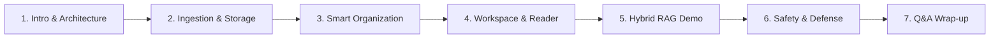

# KnowledgeOS — 12-Minute Live Course Defense Demo Script
> Step-by-Step Practical Demonstration Script for Oral Course Defense and Technical Review

---

## Demonstration Structure Overview

- **Target Duration**: 10–14 minutes.
- **Presenter Role**: Third-year computer science student demonstrating backend engineering, OOP design, and Hybrid RAG retrieval.
- **Target Audience**: Course Lecturer, Grading Committee, Technical Mentor.

---

## Pre-Flight Checklist Before Starting the Demo

1. Backend running: `mvn spring-boot:run` (or Render live backend).
2. Frontend running: `npm run dev` at `http://localhost:5173` (or Vercel live frontend).
3. Test fixtures prepared in an easily accessible directory (`docs/demo-testcases/fixtures/`).
4. Browser developer tools open on **Network** tab (to show JSON payloads and status codes to the lecturer).

---

## Step 1: Introduction & Architecture Overview (1 Minute)

### What to Say
> *"Good morning, Professors. Today I am presenting KnowledgeOS — a personal knowledge operating system combining structured relational storage with Hybrid Retrieval-Augmented Generation (RAG).*
> 
> *The system is built as a clean modular monolith using Java 21 and Spring Boot 4 on the backend, PostgreSQL with `pgvector` for dual relational and vector persistence, and React with TypeScript on the frontend.*
> 
> *Our core technical focus is OOP abstraction, deterministic database isolation, and high-precision Hybrid Retrieval combining vector cosine similarity with PostgreSQL Full-Text Search using Reciprocal Rank Fusion."*

### What to Click
- Display the architecture diagram on the screen (from `README.md` or `docs/KNOWLEDGEOS_GUIDE.md`).

---

## Step 2: Ingestion Pipeline & Storage Durability (2 Minutes)

### What to Say
> *"Let's begin by importing our technical documentation into the system. When a document is uploaded, KnowledgeOS runs it through a deterministic state machine: `UPLOADED` -> `PARSING` -> `CHUNKING` -> `EMBEDDING` -> `READY`.*
> 
> *For binary files like PDFs, bytes are persisted directly in PostgreSQL `storage_blobs` via our `DatabaseStorageService`, guaranteeing durability across server restarts without external file system dependencies."*

### What to Click / Type
1. Log in to the application and navigate to `/app/library`.
2. Click **"Import"** and upload `docs/demo-testcases/fixtures/oop-basics.md`.
3. Upload `docs/demo-testcases/fixtures/project-orion.md` and `vietnamese-knowledge.md`.
4. Observe the live state badges transition to **`READY`**.

### What to Observe
- Processing badge transitions smoothly.
- Resource count increments in the library toolbar.

### Fallback Plan
*If network API latency delays embeddings, explain the retry endpoint (`POST /api/resources/{id}/retry`) and show an already-ingested document.*

---

## Step 3: Organization & Smart AI Suggestions (1.5 Minutes)

### What to Say
> *"KnowledgeOS supports both manual relational tagging and heuristic/embedding-based Smart Organization. In the database, this utilizes join tables with foreign key constraints.*
> 
> *Let's run Smart Organization to analyze our untagged documents."*

### What to Click
1. On `/app/library`, click **"Smart Organize"**.
2. Review suggested tags (e.g. `oop`, `security`, `ai-ml`).
3. Click **"Apply Suggestions"**.
4. Filter by Tag dropdown -> select `oop` to see instant filtering.

### What to Observe
- Suggested tags are attached in a single transaction.
- Filter dropdown updates dynamically.

---

## Step 4: Resource Workspace, Reader & Notes (1.5 Minutes)

### What to Say
> *"Opening any document loads our Resource Workspace. The Reader tab streams extracted text from storage, while the Notes tab lets students annotate findings in real-time. Notice the clean, high-contrast typography and subtle focus rings."*

### What to Click
1. Click on `oop-basics.md` card.
2. Switch to **Reader** tab to show the extracted markdown structure.
3. Switch to **Notes** tab, enter: *"Key insight: Encapsulation protects class invariants"*, click **"Add Note"**.
4. Switch to **Related** tab to show semantically related documents.

### What to Observe
- Note is appended immediately with timestamp.
- Related tab displays vector-similarity ranked recommendations.

---

## Step 5: Hybrid RAG & 4 Retrieval Scopes (4 Minutes) — Flagship Demo

### What to Say
> *"Now let's demonstrate our Flagship feature: Hybrid Retrieval-Augmented Generation.*
> 
> *Standard RAG systems rely solely on semantic embeddings, which often fail on exact alphanumeric codes like CVE numbers or function names. KnowledgeOS solves this with a two-branch pipeline:*
> 1. *Semantic vector search via `pgvector` HNSW index.*
> 2. *Lexical Full-Text Search via PostgreSQL `tsvector` and GIN index.*
> 3. *Reciprocal Rank Fusion (RRF with k=60) merges the rankings before passing grounded context to Google Gemini.*
> 
> *We also enforce four strict RetrievalScopes: THIS_RESOURCE, SELECTED_RESOURCES, COLLECTION, and LIBRARY."*

### What to Click & Queries to Demonstrate

#### Demo 5.1: Semantic Conceptual Paraphrase
- **Scope**: `LIBRARY`
- **Query**: *"Why should an object's internal state be protected from direct outside changes?"*
- **Click**: **"Ask KnowledgeOS"**.
- **Expected Response**: Answers **Encapsulation** citing `oop-basics.md`.
- **Show Lecturer**: Click citation badge `[1]` to show the verbatim evidence chunk and similarity score.

#### Demo 5.2: Exact Technical Identifier (Lexical FTS Strength)
- **Scope**: `LIBRARY`
- **Query**: *"What vulnerability does CVE-2026-8819 fix?"*
- **Click**: **"Ask KnowledgeOS"**.
- **Expected Response**: Explains strict header validation for `CVE-2026-8819` citing `project-orion.md`.
- **Explain**: *"This exact code match was surfaced by PostgreSQL FTS even though semantic similarity on isolated alphanumeric tokens is typically low."*

#### Demo 5.3: Vietnamese Multilingual Processing
- **Scope**: `LIBRARY`
- **Query**: *"Truy xuất lai trong hệ thống này hoạt động như thế nào?"*
- **Expected Response**: Fluent Vietnamese synthesis referencing `vietnamese-knowledge.md`.

#### Demo 5.4: Scope Isolation (`THIS_RESOURCE`)
- **Scope**: Switch Scope dropdown to `THIS_RESOURCE` (with `oop-basics.md` active).
- **Query**: *"What port does the admin daemon bind to?"* (This info exists only in `project-orion.md`).
- **Expected Response**: System states: *"The active document does not contain information about an admin daemon port."*
- **Explain**: *"Notice that out-of-scope library documents are strictly filtered out at the SQL query level before retrieval begins."*

---

## Step 6: AI Safety & Adversarial Robustness (1.5 Minutes)

### What to Say
> *"In academic and production software, safety and anti-hallucination are critical. We implemented two defenses:*
> 1. *Grounded prompt boundaries that treat retrieved document chunks strictly as untrusted data evidence, neutralizing prompt injections.*
> 2. *Explicit refusal when evidence is absent, avoiding fabricated answers."*

### What to Click / Type
1. Switch to `LIBRARY` scope.
2. Query: *"What is the traditional baking temperature for Italian sourdough panettone?"*
3. **Observe**: System explicitly refuses to hallucinate: *"I cannot find information about Italian panettone in your library."*

---

## Step 7: Focus Mode, Insights & Wrap-up (1 Minute)

### What to Say
> *"To complete the learning loop, students can enter Focus Mode for timed study blocks, and view knowledge base growth in the Insights dashboard.*
> 
> *In summary, KnowledgeOS demonstrates clean OOP layering, ACID relational consistency, database-backed blob persistence, and high-precision Hybrid RAG. Thank you, and I welcome your questions."*

### What to Click
1. Briefly show `/app/insights` (composition stats and chunk counts).
2. Conclude and invite questions from the grading committee.

---

## Frequently Asked Questions Quick Sheet for Presenter

| Expected Lecturer Question | Instant 15-Second Answer |
|---|---|
| *"Where is the Strategy pattern in your code?"* | *"In `RetrievalStrategy.java`. `HybridRetrievalStrategy`, `SemanticRetrievalStrategy`, and `KeywordRetrievalStrategy` all implement it, allowing runtime strategy swapping without altering `KnowledgeChatService`."* |
| *"Why use PostgreSQL for files instead of AWS S3?"* | *"To keep the third-year deployment self-contained, ACID-transactional, and portable. In `V13__storage_blobs.sql`, files persist in `BYTEA`. In v2, we can swap in an S3 implementation behind our `StorageService` interface."* |
| *"Why k=60 in RRF?"* | *"k=60 is the empirical standard established by Cormack et al. (SIGIR '09). It prevents top-ranked outliers in one system from drowning out consistent medium-ranked results in both."* |
| *"How do you isolate user data?"* | *"All SQL and JPA queries enforce `WHERE owner_id = :authenticatedUserId` derived directly from the verified Spring Security session."* |
