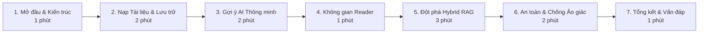

# KỊCH BẢN THUYẾT TRÌNH DEMO TRỰC TIẾP 12 PHÚT KNOWLEDGEOS
> **Tài liệu**: Kịch bản Thao tác Thực tế & Lời thoại Trình diễn Bảo vệ Đồ án  
> **Mã định danh**: `docs/05_qa_and_demo/LIVE_DEMO_SCRIPT.md`  
> **Mục đích**: Hướng dẫn chi tiết từng phút lời thoại của sinh viên và thao tác click chuột trên màn hình để gây ấn tượng mạnh nhất trước Hội đồng chấm thi.

---

## 1. TỔNG QUAN CẤU TRÚC BUỔI DEMO 12 PHÚT

- **Thời lượng tiêu chuẩn**: 10 đến 14 phút.
- **Vai trò người trình bày**: Sinh viên ngành Kỹ thuật Phần mềm / Khoa học Máy tính trình bày thiết kế kiến trúc Backend, mẫu thiết kế OOP và thuật toán tìm kiếm lai Hybrid RAG.
- **Đối tượng lắng nghe**: Giảng viên hướng dẫn, Hội đồng chấm thi và Chuyên gia đánh giá kỹ thuật.

---

## 2. DANH MỤC CHUẨN BỊ TRƯỚC GIỜ BẢO VỆ (PRE-FLIGHT CHECKLIST)

1. Khởi động Backend: chạy `./mvnw spring-boot:run` (hoặc mở sẵn Backend Cloud Render).
2. Khởi động Frontend: chạy `npm run dev` tại `http://localhost:5173` (hoặc mở sẵn link Vercel).
3. Mở sẵn thư mục tài liệu mẫu: `docs/05_qa_and_demo/fixtures/` (`oop-basics.md`, `vietnamese-knowledge.md`, `exact-identifier.md`, `prompt-injection-test.md`).
4. Mở tab **Network** trên Trình duyệt (F12) để sẵn sàng giải thích các mã trạng thái HTTP và DTO Response khi thầy cô yêu cầu.

---

## 3. KỊCH BẢN CHI TIẾT TỪNG BƯỚC

---

### Bước 1: Mở đầu & Giới thiệu Kiến trúc Tổng quan (Thời lượng: 1 phút)

#### 🗣️ Lời thoại trình bày:
> *"Kính thưa quý thầy cô trong Hội đồng, hôm nay em xin phép trình bày sản phẩm **KnowledgeOS** — Hệ điều hành quản lý tri thức cá nhân thông minh kết hợp giữa cơ sở dữ liệu quan hệ và công nghệ tìm kiếm lai tăng cường tạo sinh (Hybrid RAG).*
> 
> *Hệ thống được xây dựng theo kiến trúc **Modular Monolith** chuẩn mực bằng **Java 21 và Spring Boot 4** ở backend, **PostgreSQL 17 kết hợp pgvector và Full-Text Search**, cùng **React 19 và TypeScript** ở frontend.*
> 
> *Điểm trọng tâm kỹ thuật của đồ án là việc áp dụng các mẫu thiết kế hướng đối tượng OOP chuẩn mực (Strategy, Registry, DIP) và giải quyết triệt để bài toán tìm kiếm chính xác bằng thuật toán Hợp nhất Xếp hạng Tương hỗ (RRF $k=60$) kèm trích dẫn chứng cứ có thể kiểm chứng."*

#### 🖱️ Thao tác trên màn hình:
- Trình chiếu sơ đồ kiến trúc tổng thể trên slide hoặc mở tệp `docs/01_guides/KNOWLEDGEOS_GUIDE.md`.

---

### Bước 2: Nạp Tài liệu & Lưu trữ Bền vững BYTEA (Thời lượng: 2 phút)

#### 🗣️ Lời thoại trình bày:
> *"Em xin bắt đầu bằng việc nạp tài liệu vào hệ thống. Khi một tài liệu được tải lên, KnowledgeOS kích hoạt một máy trạng thái xác định: `PARSING` $\to$ `CHUNKING` $\to$ `EMBEDDING` $\to$ `READY`.*
> 
> *Đối với tệp nhị phân như PDF, các mảng byte được lưu trữ trực tiếp và bền vững trong bảng `storage_blobs` dạng `BYTEA` qua lớp `DatabaseStorageService`, đảm bảo dữ liệu không bị mất khi Container trên Cloud khởi động lại."*

#### 🖱️ Thao tác trên màn hình:
1. Đăng nhập vào trang Thư viện `/knowledge/library`.
2. Nhấp nút **"Thêm tài nguyên"** (Add Resource) và tải lên các tệp:
   - `docs/05_qa_and_demo/fixtures/oop-basics.md`
   - `docs/05_qa_and_demo/fixtures/vietnamese-knowledge.md`
   - `docs/05_qa_and_demo/fixtures/exact-identifier.md`
3. Quan sát các huy hiệu trạng thái chuyển đổi mượt mà sang màu xanh **`READY`**.

---

### Bước 3: Phân loại & Gợi ý AI Thông minh (Thời lượng: 2 phút)

#### 🗣️ Lời thoại trình bày:
> *"Sau khi nạp tài liệu, người dùng có thể tổ chức tri thức qua Thư mục môn học (Collections) và Thẻ phân loại (Tags).*
> 
> *Đặc biệt, hệ thống tích hợp tính năng **Smart Organization Suggestions**: phân tích vector nhúng của tài liệu để tự động đề xuất thẻ và thư mục phù hợp mà không cần gõ tay."*

#### 🖱️ Thao tác trên màn hình:
1. Tạo một Bộ sưu tập mới: *"Lập trình Hướng đối tượng"*.
2. Nhấp nút **"Gợi ý tổ chức"** (Smart Suggestions) trên tài liệu `oop-basics.md`.
3. Chấp nhận các gợi ý nhãn `#java`, `#oop`, `#design-patterns`.
4. Mở bộ lọc Thư viện, thử nghiệm lọc kết hợp theo Thư mục và Thẻ để chứng minh tốc độ tìm kiếm tức thì.

---

### Bước 4: Không gian Đọc & Ghi chú Nghiên cứu (Thời lượng: 1 phút)

#### 🗣️ Lời thoại trình bày:
> *"Khi mở một tài liệu, KnowledgeOS cung cấp không gian đọc Reader tương phản cao, tối ưu cho việc tập trung nghiên cứu.*
> 
> *Tại đây, sinh viên có thể ghi lại các ý tưởng phân tích vào mục Session Notes và tải về chính xác tệp tin gốc bất cứ lúc nào."*

#### 🖱️ Thao tác trên màn hình:
1. Nhấp mở tài liệu `oop-basics.md`.
2. Nhập một ghi chú: *"Cần ôn kỹ Strategy Pattern và Dependency Inversion cho buổi vấn đáp"*, nhấp Lưu ghi chú.
3. Cuộn xuống cuối trang để chỉ cho hội đồng thấy danh sách **"Tài liệu tương đồng"** (Related Resources) được gợi ý tự động qua khoảng cách vector `pgvector`.

---

### Bước 5: Đột phá Tìm kiếm Lai Hybrid RAG & Trích dẫn Nguồn (Thời lượng: 3 phút)

#### 🗣️ Lời thoại trình bày:
> *"Bây giờ em xin trình diễn tính năng cốt lõi quan trọng nhất: **Động cơ Tìm kiếm Lai Hybrid RAG**.*
> 
> *Thông thường, tìm kiếm vector sẽ thất bại với các mã số kỹ thuật chính xác. KnowledgeOS kết hợp đồng thời cả vector cosine (`pgvector`) và PostgreSQL Full-Text Search (GIN) qua thuật toán Reciprocal Rank Fusion ($k=60$)."*

#### 🖱️ Thao tác trên màn hình:
1. Chuyển sang trang Hỏi đáp `/knowledge/ask`, chọn phạm vi `LIBRARY`.
2. **Demo 1 (Câu hỏi tiếng Việt & Ngữ nghĩa)**:
   - Gõ câu hỏi: *"Giải thích tính đóng gói và cách nó bảo vệ trạng thái của đối tượng?"*
   - Nhận câu trả lời tiếng Việt mạch lạc, nhấp vào nhãn trích dẫn `[1]` để xem đoạn văn gốc.
3. **Demo 2 (Câu hỏi mã kỹ thuật chính xác - FTS)**:
   - Gõ câu hỏi: *"Mã lỗ hổng CVE-2026-8819 có điểm số CVSS là bao nhiêu và giải pháp khắc phục là gì?"*
   - Nhấn mạnh với hội đồng: *Nhánh FTS đã bắt chính xác mã chuỗi `CVE-2026-8819` từ tệp `exact-identifier.md` và đưa vào câu trả lời.*
4. **Demo 3 (Cách ly phạm vi Scope)**:
   - Đổi phạm vi sang `THIS_RESOURCE` (chọn tài liệu A) và hỏi nội dung chỉ có ở tài liệu B. AI sẽ từ chối trả lời do tài liệu hiện tại không chứa dữ liệu.

---

### Bước 6: An toàn AI & Phòng thủ Tấn công (Thời lượng: 2 phút)

#### 🗣️ Lời thoại trình bày:
> *"Cuối cùng, hệ thống được thiết kế với tư duy an ninh vững chắc:*
> 1. **Chống ảo giác (Anti-Hallucination)**: AI từ chối trả lời nếu tài liệu không chứa dữ liệu.
> 2. **Phòng thủ Prompt Injection**: Chúng em bọc nội dung tệp vào thẻ XML `<evidence>` thụ động kèm chỉ thị nghiêm ngặt."*

#### 🖱️ Thao tác trên màn hình:
1. Tải lên tệp `docs/05_qa_and_demo/fixtures/prompt-injection-test.md` (chứa câu lệnh cố tình xúi giục tiết lộ mật khẩu hệ thống).
2. Gửi câu hỏi: *"Tóm tắt nội dung tài liệu này?"*.
3. AI tóm tắt nội dung bình thường, tuyệt đối không bị lừa thực thi câu lệnh độc hại.
4. Đặt một câu hỏi vu vơ không có trong tài liệu (ví dụ: *"Giá vàng hôm nay là bao nhiêu?"*). AI trả lời trung thực là tài liệu không chứa thông tin này.

---

### Bước 7: Tổng kết & Sẵn sàng Vấn đáp (Thời lượng: 1 phút)

#### 🗣️ Lời thoại trình bày:
> *"Kính thưa quý thầy cô, KnowledgeOS đã hoàn thành 100% các yêu cầu kỹ thuật với 57 bài test tự động đạt kết quả tuyệt đối, cấu trúc mã nguồn OOP rõ ràng, cơ sở dữ liệu quan hệ vững chắc và tính năng Hybrid RAG có độ chính xác cao.*
> 
> *Em xin chân thành cảm ơn quý thầy cô đã lắng nghe và em rất sẵn sàng đón nhận các câu hỏi vấn đáp từ Hội đồng."*
