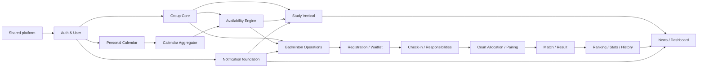

# GroupSync — Implementation Plan

> Chỉ là kế hoạch triển khai; **không phải code**.  
> Baseline quyết định nằm trong `PROJECT_DECISIONS.md`; scope gate nằm trong `RISK_AND_SCOPE_GUARD.md`.

## 1. Mục tiêu triển khai

Xây một modular monolith dễ đọc, trong đó sinh viên có thể trace một use case theo đường:

```text
React page
→ feature API/DTO
→ REST controller
→ application service + transaction
→ domain behavior/strategy
→ repository/PostgreSQL
→ derived calendar/notification/history
```

Mục tiêu không phải “có thật nhiều màn hình”, mà là hoàn thành các flow liên kết:

1. personal schedule → availability → Study Session;
2. personal schedule → badminton session → capacity/waitlist → check-in → court/pairing → result → ranking/history/news;
3. reschedule/cancel/result chỉ nhập một lần, các view liên quan tự cập nhật.

## 2. Dependency/order đã chốt



Quy tắc dependency:

- Study và Badminton chỉ dùng shared core; không gọi lẫn nhau.
- Availability không import entity Study/Badminton.
- Mỗi vertical đóng góp một `CalendarSource`; Calendar Aggregator chỉ biết interface.
- Dashboard chỉ compose read data, không chứa write business rule.
- News/notification là side effect downstream, không quyết định correctness của registration/ranking.

## 3. Definition of Done áp dụng cho mọi phase

Một phase chỉ được checkpoint khi:

1. Scope phase được implement end-to-end ở mức nhỏ nhất đã nêu.
2. Backend compile/test xanh; frontend typecheck/build xanh nếu có thay đổi frontend.
3. Business rule critical của phase có automated test.
4. Không còn secret, stack trace hoặc JPA entity lộ trực tiếp trong public API.
5. Có manual smoke check cho happy path và ít nhất một invalid/permission path.
6. Migration/schema reproducible trên database mới.
7. `docs/IMPLEMENTATION_STATUS.md` ghi completed, tests, limitation và next phase.
8. Commit/checkpoint riêng; không gộp feature phase sau để “tiện làm luôn”.

Nếu build đỏ, dừng mở rộng feature và sửa checkpoint hiện tại trước.

## 4. Phase plan

## Phase 0 — Repository bootstrap and connectivity `[Core]`

**Goal**

Tạo hai app chạy được trước khi có domain feature.

**Main areas**

- Root: README, `.gitignore`, safe env examples, docs.
- Backend: Spring Boot 4.1.x, Java 21, Maven Wrapper, Web/JPA/Security/Validation/PostgreSQL/Flyway/Test.
- Frontend: React 19.2, TypeScript, Vite, Router, Axios, Bootstrap.
- Infrastructure: PostgreSQL local setup, dev proxy/CORS, `/api/health`.

**Bounded tasks**

0.1. Verify toolchain and record exact versions.  
0.2. Bootstrap backend and one context/health test.  
0.3. Bootstrap frontend and health page.  
0.4. Configure PostgreSQL/environment variables and empty Flyway baseline.  
0.5. Verify frontend → backend health call.

**Acceptance/checkpoint**

- Fresh clone có run instructions rõ.
- Backend starts against PostgreSQL and returns JSON health.
- Frontend shows connected/error state from real API call.
- Backend package/test and frontend typecheck/build pass.
- Không có User/Group/Calendar business code.

**Depends on:** project decisions only.

---

## Phase 1 — Shared API conventions `[Core]`

**Goal**

Đặt phần nền nhỏ dùng xuyên repo, không tạo generic framework.

**Main backend areas**

`shared/configuration`, `shared/exception`, time configuration, auditing fields if justified.

**Main frontend areas**

`src/api/client`, error type/parser, base layout/router skeleton.

**Business/technical rules**

- Stable error shape.
- ISO-8601/timezone policy Asia/Bangkok.
- DTO validation errors dễ hiển thị.
- Chỉ constructor injection.

**Acceptance/checkpoint**

- Một validation failure và một not-found failure trả error shape đúng.
- Frontend API wrapper phân biệt success/error; không có global state library.
- Không có `BaseService<T>`/generic repository wrapper.

**Tests/checks:** controller test cho errors; backend/frontend builds.  
**Depends on:** Phase 0.

---

## Phase 2 — Authentication and User Profile `[Core]`

**Goal**

Đăng ký, đăng nhập, đăng xuất, current user và profile cơ bản bằng Spring Security session.

**Main backend areas**

`auth/*`, `user/model`, `user/repository`, `user/service`, auth/user DTO/controllers, Flyway migrations.

**Main frontend areas**

`features/auth`, `features/profile`, `AuthContext`, protected route, login/register/profile pages.

**Business rules**

- Email unique, normalized; password policy vừa đủ.
- BCrypt only; không plaintext/default password.
- Session cookie + CSRF; unauthenticated/forbidden phân biệt 401/403.
- System role chỉ USER/ADMIN; đăng ký mặc định USER.
- Public response không bao giờ có password hash.

**Acceptance/checkpoint**

- User register → login → refresh page vẫn có session → load current user → logout.
- Duplicate email và invalid password bị reject rõ ràng.
- Protected endpoint chặn guest.

**Tests/checks**

- Password stored hashed.
- Duplicate email.
- Login valid/invalid; current user; logout.
- CSRF flow smoke test; frontend protected navigation.

**Depends on:** Phase 1.

---

## Phase 3 — Group Core and permissions `[Core]`

**Goal**

Tạo shared group/membership/invitation model trước vertical.

**Main backend areas**

`group/model`, repository, service, DTO/controller, permission helper/policy, migrations.

**Main frontend areas**

`features/groups`: my groups, create, detail, members, invitations.

**Business rules**

- Type chỉ STUDY/BADMINTON.
- Creator trở thành OWNER trong cùng transaction.
- Unique membership user/group.
- OWNER/ORGANIZER/MEMBER permission ở service.
- Invite user đã tồn tại; một pending invitation/group/invitee.
- Accept invitation tạo membership idempotently.
- Group luôn có owner; owner không được leave trước khi transfer.

**Acceptance/checkpoint**

- 3 demo users: A tạo group, invite B, B accept, A promote B organizer, C không có quyền sửa.
- My Groups/member list đúng role/status.
- STUDY và BADMINTON group đều tạo được nhưng chưa có vertical feature.

**Tests/checks**

- Creator ownership transaction.
- Duplicate membership/pending invite.
- Permission matrix cho owner/organizer/member/non-member.
- Transfer/leave owner guard.

**Depends on:** Phase 2.

---

## Phase 4 — Notification foundation `[Core]`

**Goal**

Tạo in-app notification dùng lại từ các phase sau, chưa xây feed/push/realtime.

**Main backend areas**

`notification/model/repository/service/controller`, notification DTO, migration.

**Main frontend areas**

Notification bell/inbox, unread badge, polling/refetch hook.

**Business rules**

- Notification thuộc user ID, không phụ thuộc username mutable.
- READ/UNREAD; user chỉ đọc/mark notification của chính mình.
- Optional safe target type/id/link.
- Group invitation có thể tạo notification qua explicit service call.

**Acceptance/checkpoint**

- Invitation tạo một notification; recipient xem và mark read/all read.
- User khác không truy cập/mark notification đó.
- Không WebSocket/Firebase.

**Tests/checks:** ownership/mark-read, unread count, polling UI smoke.  
**Depends on:** Phase 2; tích hợp nhẹ Phase 3.

---

## Phase 5 — Personal Calendar and weekly recurrence `[Core]`

**Goal**

User nhập một lần các busy fact cá nhân.

**Main backend areas**

`calendar/personal`: one-time event, recurring schedule, recurrence expander, repository/service/controller/DTO, migrations.

**Main frontend areas**

`features/calendar`: My Calendar, create/edit/delete one-time and weekly schedule forms.

**Business rules**

- Ownership strict.
- Event/schedule end after start; date range valid.
- Weekly supports one or more weekdays; no full recurrence grammar.
- Privacy title chỉ owner thấy; member khác chỉ BUSY.
- Query range bounded; occurrences calculated, không persisted hàng tuần.

**Acceptance/checkpoint**

- Tạo `OOP class Mon/Wed 08:00–10:00` một lần; query hai tuần trả đúng occurrences.
- Edit/delete phản ánh ngay; cross-user access bị chặn.
- My Calendar hiển thị one-time + recurring source rõ.

**Tests/checks**

- Weekday/date boundary, overlap, timezone/offset, invalid recurrence.
- Calendar CRUD ownership and frontend date form/typecheck.

**Depends on:** Phase 2.

---

## Phase 6 — Calendar Aggregator and conflict query `[Core]`

**Goal**

Tạo unified calendar/free-busy contract trước khi vertical đóng góp source.

**Main backend areas**

`calendar/aggregation`: `CalendarSource` contract, personal source adapter, `CalendarItem`/`BusyInterval`, aggregator service/controller.

**Main frontend areas**

Calendar item source styling/legend; conflict result type.

**Business rules**

- Aggregator merge interval, không mutate source.
- Personal source là source đầu tiên; Study/Badminton thêm ở phase tương ứng.
- Privacy mask theo requesting user/group relationship.
- Conflict kiểm tra overlap chuẩn half-open interval `[start,end)` để event liền nhau không conflict.

**Acceptance/checkpoint**

- Unified query trả sorted non-duplicated items và merged busy intervals.
- `10:00–11:00` không conflict `09:00–10:00`; overlap thật bị phát hiện.
- Contract cho source mới có unit test giả lập.

**Tests/checks:** interval merge, boundaries, source aggregation, privacy.  
**Depends on:** Phase 5.

---

## Phase 7 — Availability Engine `[Core]`

**Goal**

Tìm candidate slots từ group members + aggregated busy data.

**Main backend areas**

`availability/model`, service, strategy interface + MaximumAttendance/EarliestPossible implementations, DTO/controller.

**Main frontend areas**

Organizer availability form and candidate list.

**Business rules**

- Selected/required users phải là active group members.
- 30-minute grid, duration multiple of 30, range ≤14 days.
- Required members là hard filter.
- Maximum attendance tie-break earliest; Earliest strategy predictable.
- Engine chỉ suggest, không create session.

**Acceptance/checkpoint**

- Với lịch của 3–5 users, engine trả candidate count/member list đúng.
- Organizer chọn strategy và required members; member thường không gọi organizer-only search nếu policy yêu cầu.
- Không có candidate ngoài search window hoặc đè busy interval.

**Tests/checks**

- All busy/all free, adjacent intervals, recurring input, required member unavailable, tie-break, timezone/date boundary.
- Small performance check cho 50 members × 14 days.

**Depends on:** Phase 3 + Phase 6.

---

## Phase 8 — Study Group vertical `[Core]`

**Goal**

Chứng minh shared core hoàn thành một vertical không phải thể thao.

**Main backend areas**

`study/model/repository/service/controller/dto`, Study `CalendarSource`, notification integration, migrations.

**Main frontend areas**

`features/study`: session list/detail/create from suggestion, join/leave, goals/materials/attendance.

**Business rules**

- Status DRAFT/OPEN/CONFIRMED/COMPLETED/CANCELLED và transition guards.
- Organizer create/confirm/reschedule/cancel/mark attendance.
- Member join/leave theo status/deadline/capacity nếu có.
- Material chỉ title + URL; goal checklist nhỏ.
- Confirmed participant tạo derived calendar item; reschedule/cancel phản ánh không cần sync row calendar.

**Acceptance/checkpoint**

- Organizer tìm slot → create Study Session → members join → confirm → calendar các participant hiển thị.
- Reschedule cập nhật derived view; cancel bỏ busy block và tạo notification.
- Attendance/material/goal flow chạy được.

**Tests/checks**

- Permission + status transitions.
- Derived calendar inclusion/exclusion/reschedule.
- Join duplicate/capacity; attendance only participant.

**Depends on:** Phase 3 + 4 + 7.

---

## Phase 9 — Badminton foundation: season, profile, venue, court, session `[Core]`

**Goal**

Tạo nền đúng cho flagship trước registration/match.

**Main backend areas**

`badminton/profile`, `season`, `venue`, `session` subpackages/layers, migrations.

**Main frontend areas**

Badminton group dashboard shell, venue/court CRUD, session list/create/detail.

**Business rules**

- Badminton profile thuộc membership.
- Group có active default season; season stat row được tạo lazily hoặc khi membership active.
- Venue group-scoped, Court venue-scoped.
- Session court phải thuộc venue/group đó.
- Session lifecycle guards; capacity >0; deadline ≤ start.
- Organizer-only writes.

**Acceptance/checkpoint**

- Tạo Badminton group → default season → venue/courts → draft session → open/confirm/cancel hợp lệ.
- Không chọn court của group/venue khác.
- Group member sees session list/detail; permission đúng.

**Tests/checks:** ownership constraints, lifecycle transition matrix, season uniqueness, invalid court/session.  
**Depends on:** Phase 3 + Phase 7.

---

## Phase 10 — Registration, capacity and FIFO waitlist `[Core, critical]`

**Goal**

Hoàn thành business rule flagship quan trọng nhất với transaction safety.

**Main backend areas**

`badminton/registration`: entity/repository locking query/service/controller/DTO, migration.

**Main frontend areas**

Join/cancel buttons, capacity count, registered/waitlist lists, conflict warning.

**Business rules**

- Active group member only; session OPEN; before deadline.
- Unique user/session; rejoin cancelled row theo policy đã chốt.
- Available slot → REGISTERED; otherwise WAITLISTED FIFO.
- Cancel registered → promote oldest waitlisted trong same transaction.
- Calendar conflict là warning trong response/UI, không block.
- Waitlisted không đóng góp busy interval.

**Acceptance/checkpoint**

- Demo capacity 16: users 1–16 registered, user 17 waitlisted.
- User registered cancel → user 17 promoted → notification + counts đúng.
- Duplicate/concurrent join không vượt capacity và không tạo duplicate row.

**Tests/checks**

- Boundary 15/16/17, duplicate, cancel waitlisted vs registered, FIFO ordering, deadline/status, non-member.
- Concurrency integration test hoặc controlled two-transaction test trên PostgreSQL.
- Calendar source chưa include cho tới session confirmed + registration active.

**Depends on:** Phase 4 + 6 + 9.

---

## Phase 11 — Calendar sync, check-in, no-show and responsibilities `[Core]`

**Goal**

Hoàn tất vận hành trước giờ chơi và chứng minh input-once/derive-many.

**Main backend areas**

Badminton `CalendarSource`, check-in service, responsibility entity/service/controller, notification event/listener.

**Main frontend areas**

Organizer check-in board, responsibility list/assignment, calendar status.

**Business rules**

- Confirmed active registration đóng góp calendar busy item.
- Session time/status change được view calendar phản ánh ngay và notify participant.
- Organizer mark CHECKED_IN/NO_SHOW; check-in chỉ từ REGISTERED.
- Cancellation của assignee làm responsibility unassigned/NEEDED và notify organizer.
- Responsibility chỉ lightweight state, không inventory quantity/warehouse.

**Acceptance/checkpoint**

- Confirm/reschedule/cancel session cho calendar đúng mà không tạo/sửa duplicated calendar row.
- Organizer check-in roster; member thường không mark người khác.
- Assigned shuttlecock owner cancel → responsibility cần gán lại + notification.

**Tests/checks:** calendar source status matrix, permission/transitions, responsibility cancellation listener.  
**Depends on:** Phase 10.

---

## Phase 12 — Court allocation and pairing `[Core]`

**Goal**

Biến checked-in pool thành court board và pairings dễ giải thích.

**Main backend areas**

`badminton/allocation`, `badminton/pairing`: models, strategy interfaces/implementations, application service, DTO/controller, migrations nếu persist board.

**Main frontend areas**

Checked-in pool, manual controls, auto allocation/pairing preview, confirm court board.

**Business rules**

- Chỉ checked-in players.
- Sequential allocation deterministic theo court order + stable player order.
- Random pairing nhận seed/stable shuffle để test; Balanced dựa season points/skill.
- Không duplicate player trong một round; side size 1–2; ưu tiên doubles groups of 4.
- Với leftover 1 player, để unassigned/wait next round; không tạo match vô nghĩa.
- Organizer preview trước khi persist/confirm.

**Acceptance/checkpoint**

- 8 checked-in + 2 courts → 2 court groups, mỗi player đúng một lần, pairings doubles hợp lệ.
- Manual correction được; regenerate có cảnh báo nếu sẽ overwrite draft.
- Strategy output giải thích được và deterministic khi input/seed như nhau.

**Tests/checks:** 0/1/2/3/4/5/8/9 players, fewer courts, duplicate invariant, balance invariant, permissions.  
**Depends on:** Phase 9 + 11.

---

## Phase 13 — Match and result lifecycle `[Core]`

**Goal**

Lưu doubles match đúng cấu trúc, submit/confirm score một lần.

**Main backend areas**

`badminton/match`: Match/Side/Participant/Result models, service, repository, DTO/controller, migration.

**Main frontend areas**

Match list/detail, score form, confirmation action/history shell.

**Business rules**

- Match thuộc session/season/court round; participants lấy từ confirmed pairing hoặc manual valid input.
- Hai side không overlap; 1–2 players/side.
- Score nonnegative, không hòa; result submit rồi organizer confirm.
- Chưa confirm không ảnh hưởng official stats.
- Confirm idempotent; confirmed result immutable trong Core.

**Acceptance/checkpoint**

- Pairing doubles → start → submit `21–17` → organizer confirm.
- Invalid side/duplicate/draw/double confirm bị reject bằng domain error rõ.
- Match history/detail đọc được, nhưng ranking phase sau chưa bắt buộc.

**Tests/checks:** lifecycle matrix, participant invariant, permission, score validation, idempotency.  
**Depends on:** Phase 12.

---

## Phase 14 — Ranking, statistics and history `[Core, critical]`

**Goal**

Result confirmed cập nhật derived competitive records đúng một lần.

**Main backend areas**

`badminton/ranking`, `statistics`, `history`: strategy, stat/history models, coordinator service, result-confirmed event for non-critical side effects.

**Main frontend areas**

Leaderboard, player group/season profile, ranking history and recent form.

**Business rules**

- Points strategy 3/1 cho mỗi participant thắng/thua.
- Scope group + season, không global User.
- Stats/ranking update trực tiếp trong confirm transaction.
- Ranking history append per participant/match; unique guard chống double apply.
- Recent form derive từ confirmed matches.
- Attendance/no-show lấy từ completed sessions, tách match stats.

**Acceptance/checkpoint**

- Confirm `21–17` một lần → 4 players có W/L/points đúng → leaderboard/history/recent form cập nhật.
- Retry cùng confirm không nhân đôi stats/history.
- Player ở hai group có profile/ranking độc lập.

**Tests/checks**

- Singles-compatible and doubles results.
- Idempotency/transaction rollback.
- Tie ordering, peak/history, group/season isolation.
- Only CONFIRMED result counts.

**Depends on:** Phase 13.

---

## Phase 15 — News, automation, dashboard and reminders `[Core polish]`

**Goal**

Kết nối history/community với next activity mà không xây social network.

**Main backend areas**

`news`, notification listeners/templates, reminder scheduler, `dashboard` query services/controllers.

**Main frontend areas**

Home/group dashboard, announcement/news list, notification links, organizer summaries.

**Business rules**

- Organizer manual announcement.
- Template events tối thiểu: session change/cancel, waitlist promotion, responsibility unassigned, result confirmed, leader changed.
- Chống duplicate system news bằng source event/type unique key khi phù hợp.
- Reminder scheduler idempotent; app correctness không phụ thuộc scheduler chạy đúng phút.
- Dashboard read-only compose upcoming activities, next session, registration count, recent results, leaderboard, news.

**Acceptance/checkpoint**

- Golden flow tạo notification/news có ích, không duplicate khi retry.
- Dashboard cho user/group hiển thị dữ liệu nguồn thật.
- Poll/refetch đủ cập nhật; không WebSocket.

**Tests/checks:** event template/idempotency, scheduler duplicate guard, dashboard authorization, frontend empty/loading/error states.  
**Depends on:** Phase 8 + 14.

---

## Phase 16 — End-to-end hardening and defense readiness `[Core release]`

**Goal**

Khóa Core, sửa lỗi integration và chuẩn bị demo/bảo vệ OOP.

**Main work**

- Full backend test/package + frontend typecheck/build.
- Fresh database migrations + deterministic demo seed/profile.
- Permission/validation/JPA query review.
- Mobile/desktop browser smoke for golden flow.
- Secret scan, README/run/deploy instructions.
- UML/class relationship summary và OOP evidence từ code thật.
- Performance sanity: availability 50 members/14 days; registration list; leaderboard.

**Golden checkpoint**

```text
Recurring OOP class
→ availability suggestion
→ badminton session capacity 16
→ member 17 waitlisted
→ registered cancel
→ FIFO promotion + notification + calendar
→ check-in
→ 2 courts allocation
→ balanced/random doubles pairing
→ submit/confirm 21–17
→ W/L + points + ranking history + news/dashboard
```

**Release acceptance**

- Golden flow chạy trên fresh DB không cần external API.
- Không critical permission/data-integrity bug còn mở.
- Core test/build xanh và limitations được ghi trung thực.
- Sinh viên trace và giải thích được ít nhất: encapsulated state transition, strategy polymorphism, composition MatchSide, shared CalendarSource và transactional waitlist.

**Depends on:** toàn bộ Core phases.

---

## Phase 17 — Optional Advanced backlog `[Not part of Core release]`

Chỉ chọn **một cụm nhỏ** sau khi Phase 16 xanh và được scope gate cho phép. Thứ tự khuyến nghị:

1. Season management polish + awards.
2. Partner/head-to-head statistics.
3. AvoidRecentPartner pairing.
4. Multi-set badminton score.
5. CSV export.
6. Google Calendar one-way export/sync.
7. QR check-in.
8. Tournament.
9. Elo strategy.

Mỗi advanced item phải có decision addendum, acceptance criteria và rollback plan riêng; không kéo nhiều item vào cùng lúc.

## 5. Suggested team ownership (5 members)

Ownership không tạo silo; module owner chịu trách nhiệm review integration contract.

| Member | Primary ownership | Mandatory pairing point |
|---|---|---|
| A | Auth/User/Group/permissions | Review every organizer permission use case |
| B | Personal Calendar/Aggregator/Availability | Pair with Study and Badminton calendar source owners |
| C | Study/News/frontend shared UX | Pair on notification templates/dashboard |
| D | Badminton session/registration/waitlist/check-in/responsibilities | Pair with B on calendar, E on checked-in handoff |
| E | Court/pairing/match/ranking/stats | Pair with D on roster and C on news/dashboard |

Cross-review rules:

- Không merge domain API contract khi consumer owner chưa review.
- Migration cùng bảng phải do một owner điều phối.
- Mỗi critical phase có ít nhất hai người chạy demo checkpoint.

## 6. Recommended Codex task order

Mỗi task Codex chỉ nhận **một bounded task hoặc một phase nhỏ**, theo thứ tự:

```text
0.1 → 0.2 → 0.3 → 0.4 → 0.5
→ Phase 1
→ Phase 2
→ Phase 3
→ Phase 4
→ Phase 5
→ Phase 6
→ Phase 7
→ Phase 8
→ Phase 9
→ Phase 10
→ Phase 11
→ Phase 12
→ Phase 13
→ Phase 14
→ Phase 15
→ Phase 16
```

Không dùng prompt “build toàn bộ GroupSync”. Khi task vượt quá một checkpoint có thể test độc lập, tách task trước khi code.
